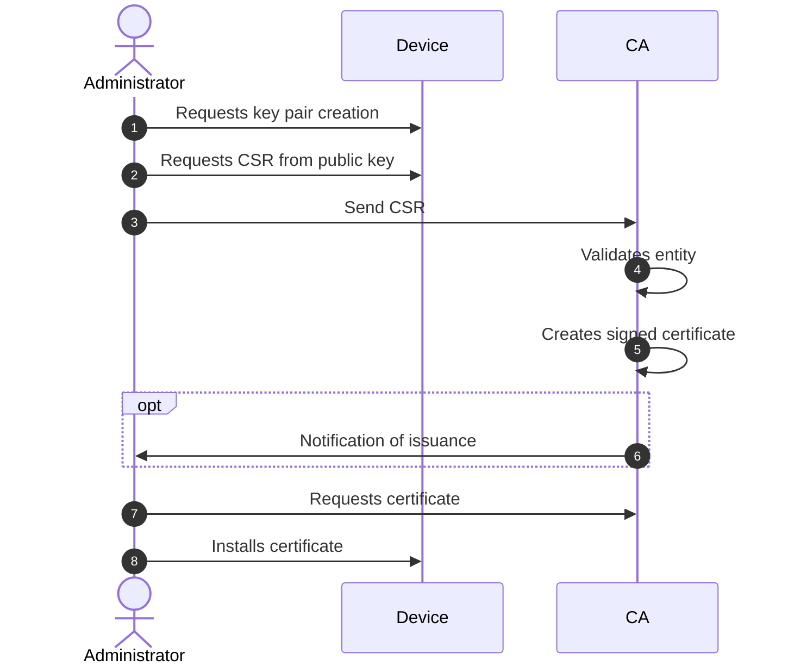
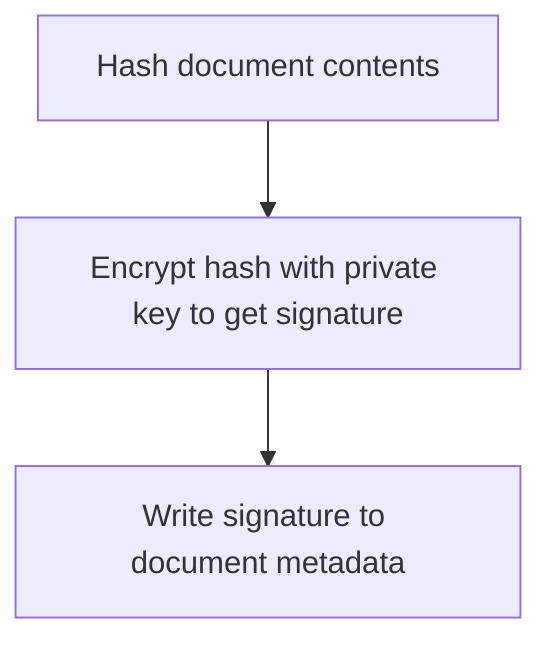
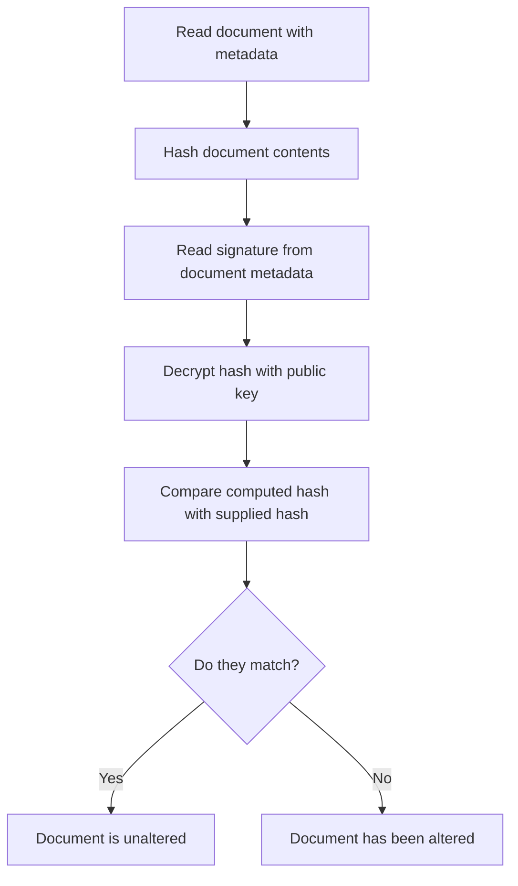

# Digital certificates, public-key cryptography, and X.509

## Digital certificates

Digital certificates address and solve the foundational issue of
enabling trust between parties that want to securely exchange
information (like the browser and the website in our example), by
creating strong and verifiable identities vouched by Certification
Authorities (CAs).

CAs are entities acting as "anchors of trust", which means that they
must be inherently trusted by both parties. They are responsible for
issuing, retaining, and revoking those certificates.

## Public-key cryptography

At the core of digital certificates there's the **public-key
cryptography** (or asymmetric cryptography), which is used to
cryptographically bind an identity (such as organization name or a
website's URL) to a public key using a digital signature. The result are
strong identities, in the sense of neither cloneable nor alterable,
protected by a signature which authenticity can be verified. That's how
trust is established.

## The public key and the private key

So how does public-key cryptography work? Public-key cryptography uses a
keypair consisting of two mathematically related, but different, keys: a
public key, and a private key. Unlike symmetric key algorithms that rely
on one key to both encrypt and decrypt, in public-key algorithms, each
key performs a unique function.

<table>
    <thead>
        <th>
            &nbsp;
        </th>
        <th colspan=4>
            Usage
        </th>
        <th>
            &nbsp;
        </th>
    </thead>
    <thead>
        <th>
            Key Type
        </th>
        <th>
            Decryption
        </th>
        <th>
            Encryption
        </th>
        <th>
            Digital signatures
        </th>
        <th>
            Signature verification
        </th>
        <th>
            Protection
        </th>
    </thead>
    <tr>
        <td>Private</td>
        <td>Yes</td>
        <td>No</td>
        <td>Yes</td>
        <td>No</td>
        <td>Kept secret</td>
    </tr>
    <tr>
        <td>Public</td>
        <td>No</td>
        <td>Yes</td>
        <td>No</td>
        <td>Yes</td>
        <td>Shared openly</td>
    </tr>
</table>

The table refers to a digital signature.  This is explained later in the content.

The key pair is a pair of large, related prime numbers, which are
related to each other through multiplication. Because prime
factorization of large numbers is computationally infeasible with all
currently available technology, it's not possible to derive the private
key from the public key or vice-versa, and thus you can freely
distribute the public key associated with the private key that you own.
That's why it's called "public".

As an aside, note that the selection of "private" and "public" is
arbitrary in this scenario; the important thing is that the key chosen
as the "private" key is kept safe and protected.

## The X.509 certificate format

Going back to certificates: [ITU standard
X.509](https://www.itu.int/rec/T-REC-X.509/en) defines the format of
Digital Certificates which use asymmetric encryption to
cryptographically seal a data object.

Certificates consist of a set of fields, which have been expanded over
time from Version 1, through Version 2, to Version 3. As said, the goal
is cryptographically binding the subject's identity to the subject's
public key via a digital signature made by an entity which is the
"issuer" of the certificate. An X.509 certificate includes:

- The **subject's identity**, consisting of information such as a
    hostname, a fully qualified domain name, an organization name, an
    individual name, and so on
- The **subject's public key**, associated with a private key which is
    NOT included in the certificate but rather kept securely under the
    certificate owner's control
- The **issuer** of the certificate
- The **signature algorithm** used for the digital signature on the
    certificate; there are multiple signature algorithms including some
    that are no longer considered secure (e.g. SHA-1) and thus are
    [deprecated](https://nvlpubs.nist.gov/nistpubs/Legacy/SP/nistspecialpublication800-107r1.pdf)
    in many scenarios; in general, the stronger the hashing algorithm,
    the better
- **Miscellaneous other information** in "extensions" possibly
    including fields such as:
  - The method to check the revocation status of the certificate
  - The allowed use cases for the certificate (e.g. "this can be
        used by a server to identify the server")
- A **digital signature**, made by the issuer, to seal the entire data
    object

[(image source)](https://comp38411.jtang.dev/docs/public-key-infrastructure/x509-certificates/)

The full list of fields is documented at [Tutorial - Understand X.509
public key certificates for Azure IoT Hub \| Microsoft
Learn](https://learn.microsoft.com/azure/iot-hub/tutorial-x509-certificates)
and at [X.509 Public Key Certificates - Win32 apps \| Microsoft
Learn](https://learn.microsoft.com/windows/win32/seccertenroll/about-x-509-public-key-certificates).

Because the signature generation includes the CA's private key, it's
possible to validate that the certificate has not been tampered with
after the CA has issued it.

The certificate itself is meant to be public, and it is freely
distributed to tell other parties who the owner is, and to let others
verify such an identity statement.

But how can someone verify the certificate (and hence the identity
stated in the certificate)?

## The certificate "chain of trust"

Let's say that A (the browser) receives a X.509 digital certificate from
B (Microsoft website) with:

- The subject's information (such as the "Common Name" or a "Subject
    Alternate Name") set to
    "www.microsoft.com"

- An "issuer" field pointing to an entity C, which issued (i.e.
    signed) the certificate.

For A to validate the B's certificate signature, A needs C's public key
(which is paired to the private key that C used to create the
signature). Where does the browser get that from? Through a certificate,
of course! That certificate in turn may be issued by a Certification
Authority "D" and recursively by other CA entities all chained together.
That's the concept of "chain of trust".

[(image source)](https://knowledge.digicert.com/solution/SO16297.html)

Is the "chain of trust" endless? No - the so-called "intermediate" CAs
chain up to a "root" CA certificate, which is a special one: it's a
"self-signed" certificate (where the subject equals the issuer).

That's the "anchor of trust":

- If you don't trust the root, you won't trust the entire chain and
    hence you cannot trust the end (or "leaf") certificate.

- If you trust the root, and if all the signatures along the chain are
    successfully validated, you can eventually trust the end
    certificate.

This still causes a problem, though, because how and why does the device
trust the root CA?

## Private CAs vs Public CAs

Let's distinguish between two cases:

- A **private** (or "enterprise") CA, which you create and manage

- A **public** CA, owned and managed by a 3^rd^ party

### Private CAs

A private CA is an internal entity that you manage and control that
issues digital certificates that are only known (and trusted) within the
boundaries of your organization, network, IT environment, supply chain
and business processes. You own the private keys (of root and
intermediate CAs), which you must safely stored. Those are used to issue
your certificates through a robust process, properly monitored and
audited, to make sure there's no leakage of misuse of the keys. Assuming
you have appropriate knowledge, skills, QA processes, and security
processes for safely running a private CA, then that's all for internal
use cases: you trust it because you trust yourself. You must deploy the
root CA certificate to as a trusted CA to all the downstream entities
that are expected to accept (and validate) your certificates.

However, only devices on which you directly or indirectly manage the
collection of trusted root CAs will be able to accept and validate
certificates issued by your private root CA or an intermediate CA that
chains back to your private root.

### Public CAs

But what if you want parties outside of your trust boundaries to trust
your certificates? They would need to receive your root CA certificate
through a secure and trusted channel. Most importantly, they should
trust your ability to run the CA properly, and keep it monitored and
audited.

That's why public CAs exist: they are companies, or institutions, that
are well-known and respected in the industry for running the entire
process in a proper, secure, reliable, documented, audited way. How this
is done and validated depends on the CA and the party responsible for
managing the list of trusted CAs. For example,
[Microsoft](https://learn.microsoft.com/security/trusted-root/new-ca-application)
manages the list of root CAs trusted by default on the Windows operating
system, while [Mozilla](https://wiki.mozilla.org/CA) manages the list of
root CAs trusted by the Firefox browser. There are also [public,
cross-vendor
discussions](https://groups.google.com/a/ccadb.org/g/public) around
these lists.

Public CAs traditionally were paid-for, commercial enterprises or
government-associated entities, capable of issuing certificates for many
different use cases. However, with the establishment of the non-profit organization
[Let's Encrypt](https://letsencrypt.org/), there is a
now a third option, where, in exchange for a higher level of automation
and a lower level of validation (domain-name based validation only), a
basic web site certificate can be created for free. Let's Encrypt does
not offer the full range of certificate types, but instead focuses
instead on the very specific use case of "securing client communications
against a web server".

But, where is that list of root CAs trusted by a client service or
device stored? That's where the idea of a "trusted root store" comes in.

## Trusted Root Store

The trusted root store is a mechanism, usually embedded in the operating
system or in the browser, that automatically and securely collects and
keeps up to date the public Root CA certificates that can be trusted. As
mentioned above, companies such as Microsoft, or organizations such as
Mozilla, create and maintain such databases. Those companies
continuously monitor the reputation of public CAs, possibly
participating in due diligence and auditing processes, investigating,
and reacting to incidents that may compromise trust. That's how they
build and maintain trust between you and the public CAs.

In some specific cases, such as
[node.js](https://github.com/nodejs/node/issues/4175), an application
runtime may choose to host its own trusted root store, independent of
the operating system, similar to how a browser might choose to do so.
It's up to each runtime owner to make the decision about how to approach
this problem and up to each application owner to understand how their
runtime environment handles this.

Generally, trusted root CA certificates are "self-signed", meaning they
have no parent trust. This makes sense, because if the root CA
certificate was signed by another certificate, it would actually be an
intermediate certificate. [(footnote 1)](#1)

## Certificate lifecycle

Once established, trust must be maintained over time. Trust can be
renewed or revoked. Because of this, digital certificates have a finite
lifespan and are considered invalid upon expiration. (As an aside, this
means that the system depends on the client device having a proper local
date and time to be able to properly validate the expiration date.)

Certificates are usually renewed before the expiration to avoid service
disruption (e.g. a service is not trusted anymore by a client or an IoT
device cannot connect anymore to the cloud). However, there are cases
where certificates must be replaced earlier, such as:

- Deprecation of weak cryptographic algorithms (e.g. SHA-1)
- Flaws (e.g. Heartbleed affecting OpenSSL)
- Changes to the company organization, process, and policies

A certificate may also be explicitly revoked for different reasons, such
as:

- Its private key has been compromised or lost
- The information stored in the certificate is outdated

Managing the certificates lifecycle in a robust, consistent, and ideally
automated way is key to preventing failures and typically required to
meet compliance requirements. In addition to service disruption,
failures could be exploited by malicious actors to launch attacks or
steal sensitive data.

The lifecycle of a certificate can be broken into the following stages:

- Certificate Enrollment
- Certificate Validation
- Certificate Renewal
- Certificate Revocation

### Certificate enrollment

The process of certificate enrollment is the generation of a certificate
signed by a certificate authority:

1. An administrator requests the device create a private/public
    keypair.
2. The administrator requests the device generate a Certificate Signing
    Request (CSR) tied to the public key of the keypair. Notice that the
    private key remains exclusively with the device and is never sent to
    the CA or another party.
3. The administrator sends the request to a Certificate Authority (CA).
4. The CA validates the entity using whatever processes used by the CA.
5. The CA creates a signed X.509 certificate as described earlier in
    this document.
6. Optionally, the CA notifies the administrator of issuance.
7. The administrator retrieves the certificate from the CA
8. The administrator installs the certificate on the device.

Note that "administrator" here could be a person, or it could be an
automated process on the device.

This diagram illustrates the process:

### Certificate validation

When a certificate is presented by an entity to a client, the
certificate status is
[validated](https://www.sciencedirect.com/topics/computer-science/certificate-validation#:~:text=The%20certificate%20validation%20process%20typically%20proceeds%20in%20three,root%20and%20intermediate%20certificates%20trusted%20by%20the%20application.)
to verify that:

- It's issued by a trusted CA
- It's listed identity matches the entity's presented identity
- It isn't expired
- It isn't revoked
- It's issuance has been logged properly

Certificate validation is a complex process and applications typically
use APIs and libraries such as OpenSSL, CryptoAPI, or Java JCE to
perform it. At a very high-level, the validation process is as follows:

1. Construct the presented CA chain. Constructing the complete
    certificate path requires that the validator is in possession of all
    the certificates in that path. This requires that the validator keep
    a database of intermediate certificates or that the protocol using
    the certificate supply the needed intermediates. In case of TLS
    certificates, a server will typically present the complete chain
    (the server certificate, any intermediate certificates, and the root
    CA certificate) as part of the TLS negotiation.
2. Validate the root certificate is trusted by comparing to the list of
    certificates in the root certificate store to ensure the entire
    chain is trusted.
3. Check chain validity dates (not-before and not-after) and
    constraints, if present (policy and key usage).
4. Consult CA revocation information, if available; certificates may
    contain extensions that point to Certificate Revocation List (CRL)
    storage locations or to Online Certificate Status Protocol (OCSP)
    responders. These methods allow the verifier to check that a CA has
    not revoked the certificate in question.
5. Consult the CA issuance log, if available; modern CAs are expected
    to host a **Certificate Transparency** (CT) log that clients can
    check on a regular basis. (This is oversimplifying this process on
    purpose; more can be found at [DigiCert](https://www.digicert.com/faq/certificate-transparency/how-it-works.htm)
    and at [IBM
    Developer](https://developer.ibm.com/blogs/certificate-transparency-for-web-and-mobile-apps/),
    among other places.)

### Certificate pinning

Certificate validation has an optional extra step as well, related to a
feature known as [certificate
pinning](https://learn.microsoft.com/en-us/windows/security/identity-protection/enterprise-certificate-pinning).
With certificate pinning, the certificate subject (e.g. domain name) is
permanently stored with the associated valid certificate, either as part
of the first time the certificate is seen or as part of the
configuration of the client. This prevents the certificate from being
changed later by a malicious actor, as it will no longer be the "pinned"
certificate and thus not trusted. This is a stronger validation than
just validating the issuer is trusted by the root certificate store, as
it's very specific for a certificate subject. This allows for a
perceived higher level of security, but it also makes it much harder to
deal with valid field changes in the case of public certificates where
the client is managed by an organization unrelated to the subject's
organization. For example, when Azure rotated its IoT CA, field devices
that had pinned the specific certificates for their IoT Hubs that were
issued by the old CA broke, because they no longer trusted the service
certificates presented by Azure services (as they had changed).

As stated in [Microsoft
Learn](https://learn.microsoft.com/en-us/windows/security/identity-protection/enterprise-certificate-pinning):

> External domain names, where the certificate issued to these domains
> is issued by a public certificate authority, are not ideal for
> enterprise certificate pinning.

There's mixed opinions in the community about the use of certificate
pinning &mdash; for example, while Microsoft Learn and DigiCert
[discourage](https://www.digicert.com/blog/certificate-pinning-what-is-certificate-pinning)
it, the OWASP foundation
[states](https://owasp.org/www-community/controls/Certificate_and_Public_Key_Pinning):

> You should pin anytime you want to be relatively certain of the remote
> host's identity or when operating in a hostile environment. Since one
> or both are almost always true, you should probably pin all the time.

However, even in that article is this statement:

> Assuming your application has no bugs or security defects, the
> application would be updated every year or two.

In an IoT scenario, this may not be a practical option, depending on
field update capabilities. Thus, when implementing an IoT device, an
implementer needs to be very careful if implementing certificate pinning
to make sure that there is the ability to securely update the pinning
information in the field, including considering the possibility of a
device being offline for a long period of time.

### Thumbprint validation and self-signed certificates

Although that process is the common certificate validation process,
there are other processes possible, although they are not as commonly
seen.

One alterative validation mechanism known as **thumbprint validation**.
Thumbprint validation essentially calculates a binary hash of the entire
certificate, and then compares it to a list of trusted hashes. This is a
very specialized use case, as it's tied to the specific certificate, and
does not tolerate any variation. This means that standard rotation on
expiration will break validation, which means it's not practical for
field use. It is useful for very highly controlled environments or very
short-term use cases, however.

Another is the handling of "self-signed" certificates, which are created
without using a CA (private or public). Due to the absence of a CA
acting as an anchor of trust that you can use for validating a
certificate, self-signed certificates have no trust value. They can only
be compared to the trusted validation list (similar to thumbprint
validation). Because this does not inherently allow for validation of
trust, it's of limited value outside of development scenarios. The one
production case where this is seen commonly is that root CAs are
generally self-signed, and thus are trusted through the root certificate
store, which is essentially a list of known certificates as described
above. [(footnote 2)](#2)

### Certificate revocation

If a certificate needs to be revoked before the expiration date, the CA
can be requested to add such certificate to its Certificate Revocation
List (CRL). A certificate may be revoked because its private key has
been compromised or lost, or the information in the certificate is
outdated. The concept of a CRL is also part of the X.509 standard, and
it identifies all of the digital certificates that have been revoked by
the issuing CA prior to the scheduled expiration date. These revoked
certificates should no longer be trusted.

CRLs offer a simple way to distribute information about these invalid
certificates. However, their use is increasingly deprecated by popular
web browsers and clients in favor of the [**Online Certificate Status
Protocol
(OCSP)**](https://learn.microsoft.com/openspecs/windows_protocols/ms-ocsp/5792b4c4-c6ba-439a-9c2a-52867d12fb66)
and OCSP stapling, which offer complete revocation features.

### Certificate renewal

Upon expiration, a certificate may be either automatically renewed (if
allowed by the policy and if there's an automatic lifecycle management
solution in place) or manually renewed.

## Asymmetric encryption in practice and TLS

As described above, in an asymmetric encryption algorithm, there are two
keys involved, a public key and a private key. Although this is very
secure, and is directly used in some cases, such as in email encryption
scenarios, it's relatively slow and resource intensive.

Thus, for bulk encryption and/or for resource-constrained devices,
something different is done; this includes the case of **transport-layer
security** (TLS), which is used for secure web communication (HTTPS) and
other secured protocols. In those situations, asymmetric encryption is
used to protect a negotiated symmetric encryption key for bulk
encryption and decryption. That symmetric key is rotated on a regular
basis as part of TLS.

The symmetric key negotiation includes deciding on an encryption
algorithm and an encryption key length as well as a data integrity
(**message authentication code**, or MAC) algorithm. This is shown in
mentions of things like "DHE-PSK (forward secrecy)" and "AES GCM". For
the purposes of this topic, these are not particularly important
details. There is published guidance around recommended IoT device
configuration at [Azure IoT Hub TLS support \| Microsoft
Learn](https://learn.microsoft.com/en-us/azure/iot-hub/iot-hub-tls-support),
and an implementer is advised to follow the documented best practices.

## Digital signatures

One use of asymmetric encryption mentioned above that hasn't been explained before
is the concept of digital signatures.
Digital signatures allow for ensuring content (which may be encrypted or unencrypted)
has not been altered in transit.

A digital signature is created by hashing the document,
then encrypting the hash with the private key of the issuer.
Because the public key is shared, this allows anyone to verify the document
has not been changed.
These diagrams illustrate this:

### Document signing

### Signature validation

<a name="1">footnote 1: This is deliberately avoiding a discussion of so-called
    "[cross-signing](https://learn.microsoft.com/windows-hardware/drivers/install/cross-certificates-for-kernel-mode-code-signing)",
    which adds a layer of complexity to this discussion that is not
    necessary for our purposes.</a>

<a name="2">footnote 2: Again, ignoring "cross-signed certificates".</a>
