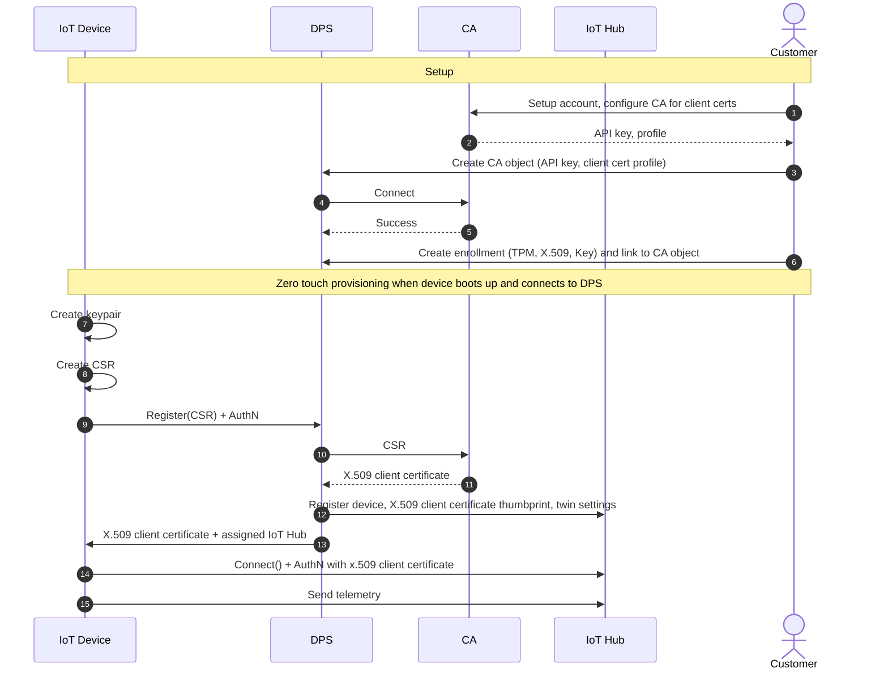

# Azure IoT

Now that the basics of how asymmetric encryption and certificates work
have been described, it's possible to move on to how they work in Azure
IoT scenarios.

## Server certificates

Like any secure web services, Azure IoT Hub and the Azure IoT Hub Device
Provisioning Service (DPS) [support
TLS](https://learn.microsoft.com/en-us/azure/iot-hub/iot-hub-tls-support),
and in fact they both require it. The services expose this through the
REST-based APIs for the management plane and through the AMQP, MQTT, and
HTTP endpoints for the data plane. These services enforce the use of TLS
and do not support unencrypted access on any of these three protocols.
Because of that, it's necessary for an IoT device using the Azure IoT
platform to support TLS in its runtime, including an appropriate root
certificate store.

Furthermore, because Azure, like all service providers, rotates
certificates at times, it's necessary to take that into account. This
may even happen at the root level, as described at [How to migrate hub
root certificate - Azure IoT Hub \| Microsoft
Learn](https://learn.microsoft.com/en-us/azure/iot-hub/migrate-tls-certificate?tabs=portal).
The devices must have an appropriate root store in place to support all
known issuers, as well as have a way to update the devices to new
certificates as necessary.

## Client (device) certificates (device authentication) for IoT Hub DPS

Azure IoT Hub Device Provisioning Service (DPS) supports [three
attestation
mechanisms](https://learn.microsoft.com/azure/iot-dps/concepts-service#attestation-mechanism)
(types of device identity verification) for devices:

1. [Shared access signature (SAS)
    tokens](https://learn.microsoft.com/azure/iot-dps/concepts-symmetric-key-attestation?tabs=windows),
    built on a shared password ("symmetric key") that is associated with
    the device or the enrollment group
2. [Trusted Platform Module
    (TPM)](https://learn.microsoft.com/azure/iot-dps/concepts-tpm-attestation)
    nonce challenges
3. [X.509
    certificates](https://learn.microsoft.com/azure/iot-dps/concepts-x509-attestation)

For the purposes of this topic, SAS tokens are out of scope.

### TPM nonce challenges

For the purposes of this topic, the implementation details of TPM nonce
challenges are not important. The important understanding for this
selection is that the TPM is *not* being used to store a certificate,
but is instead acting as its own identification mechanism. If the TPM is
being used to store a certificate, which is then used to attest to the
device identity, then the nonce challenge mechanism is not being used,
and the next option, through the use of an X.509 certificate, applies.
As this topic is focusing on certificate use cases,

### X.509 certificates

As described earlier, an X.509 certificate consists of a public key and
a private key, and the client's possession of the private key is proven
through work done against the public key. For DPS, this is done as part
of the provisioning transaction. The device must have a certificate
where the subject common name (CN) matches the registration ID for the
device, where the registration ID is a unique per-device identifier.

As with any asymmetric encryption implementation, it's critical that the
device securely stores the private key, because if it's compromised, any
device can present as the target device. This means that a secure device
design includes a [hardware security module
(HSM)](https://en.wikipedia.org/wiki/Hardware_security_module), which
may be part of a TPM or it may be a distinct unit. The HSM in this
scenario is used to store the device's private key.

But, what is happening to validate that certificate is trusted and has
been issued by a trusted CA? There are two options available.

#### Individual enrollments

Individual enrollment entries are configured with the public key of the
device certificate associated with a specific device. Managing this is
easiest for small deployments, as every new device means a new
enrollment entry in DPS, including uploading of a public key.

#### Enrollment groups

Enrollment group entries are associated with a specific intermediate or
root CA certificate. These entries control enrollments for all devices
that have that intermediate or root certificate in their certificate
chain. Managing this is preferred for larger deployments, as all new
devices are covered with a single entry, as long as the devices have
their certificates issued by a trusted CA. The DPS configuration here
indicates the trusted CA from some level of the hierarchy (an
intermediate CA or a root CA); any device certificates that chain to a
trusted CA are associated with the enrollment group.

When configuring DPS with the trusted CA public key information, if an
intermediate CA certificate is referenced, [the full chain to the root
CA must be
configured](https://learn.microsoft.com/azure/iot-dps/concepts-x509-attestation#dps-device-chain-requirements),
otherwise certificate validation will fail. This is not unusual for
certificate-based authentication validation, but it's worth calling it
out to avoid possible misunderstanding.

#### Certificate sourcing and installation

When using certificate authentication, a natural question to answer is
"where are the certificates coming from?"

Traditionally, this is done on the manufacturing line, where a local CA
issues certificates to the device as it's going through initial
programming. This CA would be an intermediate CA that chains to a
manufacturer's root CA, which is either a self-signed root or is itself
an intermediate CA that chains to a trusted public CA. For smaller
manufacturing scenarios, this is a valid path. Security is as high as
the manufacturing line itself (which must be at least somewhat trusted
by definition).

However, there is a potential scalability concern here, because the time
for a CA to issue a certificate now becomes a bottleneck; furthermore, a
failure of the CA potentially leads to a failure of the manufacturing
line. The latter is sometimes brought up as an objection to this pattern
in 24x7x365 manufacturing scenarios, but there are very few truly
24x7x365 manufacturing scenarios. For example, automobile manufacturing
is often referenced, but auto manufacturing has built-in stops for
retooling, vacation time, etc. (thus supporting maintenance windows on
the CAs). Also, certificates are not going to be issued to the vehicle
as a whole, but to one or more modules on the vehicle, which are built,
then installed into the vehicle, which means that the certificate
installation process can be decoupled from the assembly line. In other
words, with proper planning, the CA is not part of the mainline assembly
process, and the objections to this process are safely satisfied.

There is another way to approach this, however; there is a DPS
capability in preview that allows issuing a per-device certificate to a
device on first boot, as part of zero-touch provisioning. The initial
request must authenticate using one of the standard authentication
methods, but once that is done, the device will receive a certificate,
and optionally a new trust bundle (collection of certificates to apply
to the local device trusted root store), and then be able to use that
for its future authentication work. This does still mean a temporary,
secured connection, including a TLS-protected DPS transaction and
authentication, but it allows a bootstrapping of later steps.

What CA does DPS use to retrieve that device certificate? It uses a CA
configured as part of the DPS configuration. Similarly, the trust bundle
is part of the DPS configuration. The overall process diagram is shown
below:

## Client (device) certificates (device authentication) for IoT Hub

Azure IoT Hub supports [three authentication
mechanisms](https://learn.microsoft.com/azure/iot-hub/iot-hub-dev-guide-sas?tabs=node#authenticating-a-device-to-iot-hub)
for devices connecting to IoT Hub:

1. Shared secrets ("symmetric key"), which is a per-device password
2. SAS tokens, which are generated based on a symmetric key
3. X.509 certificates

Only the last choice, X.509 certificates, is in scope for this topic.

In general, the same rules as for DPS apply. If DPS is in use, the
preview for certificates can be used for obtaining a certificate, or the
device can have one installed during manufacturing. Some customers
choose to develop their own onboarding solution independent of, or in
concert with, DPS that handles certificate issuance.

Because there is a lot of overlap with the DPS design considerations,
there's not a need for substantial detail here.
