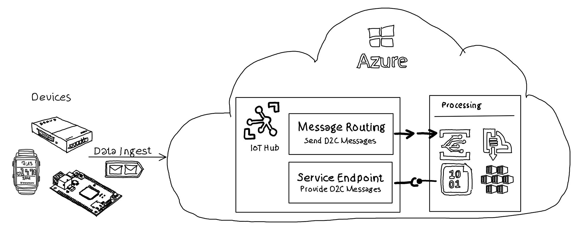
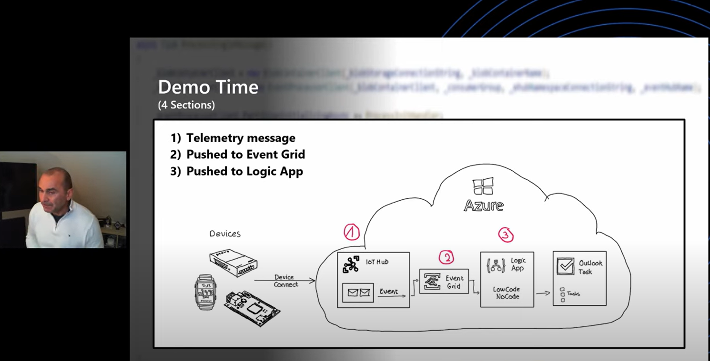
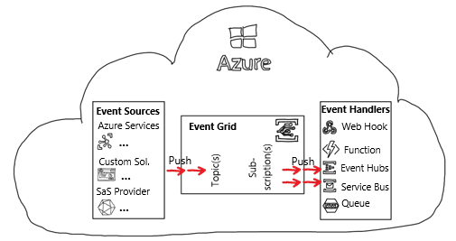

# Data Egress - Event Grid integration

## Overview

Azure IoT Hub is a fully managed service that helps enable reliable and secure bi-directional communications between millions of devices and a solution back end.

Custom functionality which processes data or messages sent from devices to IoT Hub can retrieve information using two different patterns:

* Message Routing: IoT Hub actively ***pushes*** messages
* Integration with Event Grid: IoT Hub actively ***pushes*** messages
* Service Endpoint: IoT Hub provides messages to be ***pulled***

  

### TL;DR

This example highlights:

* sending data to IoT Hub from a device emulator
* IoT Hub pushing incoming messages to a custom Logic App using Event Grid
* messages are processed in a custom Logic App
* Logic App creates a task in Outlook if energy consumption of a device is above a certain threshold.

### Watch the video / Get the presentation

[Get the presentation](media/IoTTrainingKit-DataEgress-EventGrid.pdf)

## IoT Hub Functionality

### Event Grid Integration (Push of messages)

Azure IoT Hub integrates with Azure Event Grid so that you can push events to other services. Using the integration with Event Grid receiving applications can react to critical events in a reliable, scalable, and secure manner.

IoT Hub can push device state changes and device to cloud messages in near-real time to a subscribing service (Event Handler).

### Topics / Subscriptions

IoT Hub acts as a so called Event Source and pushes messages to Azure Event Grid Topic(s). Event Handlers can subscribe to this events using an Event Grid subscription where Event Grid pushes the messages to the Event Handler.

## Example Code

Please see the [DataEgress - Event Grid](https://github.com/Azure/IoTTrainingPack/tree/main/modules/DataEgress-101-EventGrid) folder for an end-to-end sample.
