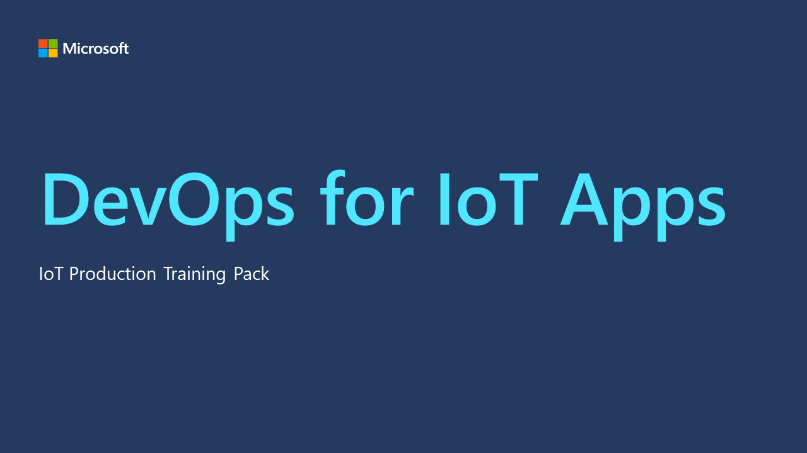

# DevOps with Azure IoT

Azure IoT is Microsoft's cloud platform for IoT solutions. It provides a suite of services and tools for building and managing IoT applications. These services enable you to securely connect, monitor, and control your devices, ingest and process your data, and build intelligent applications with analytics and AI. Azure IoT Applications are a part of your overall Azure solutions, and can be integrated with other Azure services, such as Azure Functions, Azure Machine Learning, and Azure Stream Analytics.

[DevOps](devops.md) is a set of practices that combines software development (Dev) and IT operations (Ops) to shorten the development lifecycle, increase deployment frequency, and deliver applications more reliably. DevOps aims to automate and streamline the software delivery process, from code changes to production deployment, using collaboration, communication, and feedback loops.

[Infrastructure as Code (IaC)](iac.md) is a core practice of DevOps that involves managing infrastructure (networks, virtual machines, load balancers, and connection topology) in a declarative and repeatable way, using version control to store the files. By treating infrastructure as code, you can apply the same software engineering practices to your infrastructure as you do to your applications, such as continuous integration (CI), continuous delivery (CD), and automated testing.

Azure IoT and DevOps can work together to build scalable, reliable, and secure IoT solutions using IaC. By using IaC, you can define the infrastructure that needs to be deployed in code, store it in a source code repository, and version it like any other code. You can then use DevOps practices to automate the deployment and management of your IoT infrastructure and applications, from development to production.

[DevOps with IoT Apps Presentation ](./media/DevOpsWithIoTApps.pdf)

Some of the benefits of using IaC with Azure IoT and DevOps include:

Speed and Agility: You can quickly provision and scale your IoT infrastructure and applications using code, reducing the manual effort and error-prone tasks involved in managing infrastructure manually.

Consistency and Compliance: You can ensure that your IoT infrastructure and applications are deployed consistently and comply with industry standards and regulations using IaC templates and policies.

Collaboration and Governance: You can use version control and collaboration tools to manage changes and access to your infrastructure and applications, providing transparency and accountability.

Resilience and Security: You can automate the backup, recovery, and monitoring of your IoT infrastructure and applications using IaC and DevOps practices, increasing their resilience and security.

Azure provides several tools and services for IaC, such as Azure Resource Manager (ARM), Azure Bicep, Terraform, and Azure CLI. These tools allow you to define, deploy, and manage your infrastructure and applications using code, automate your deployment and testing pipeline, and integrate with your existing DevOps tools and workflows.

