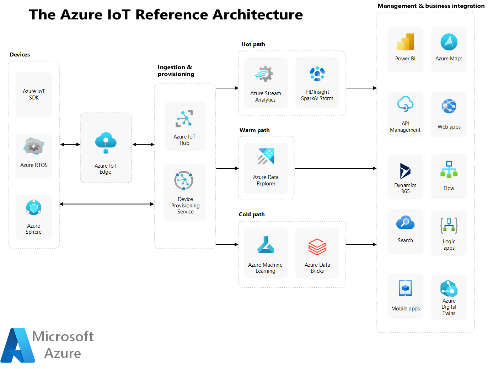

# Sample Azure IoT Application Architecture

Azure IoT services are a collection of cloud services that enable you to connect, manage, and analyze data from millions of devices. Azure IoT Hub and other Platform-as-a-Service (PaaS) services can be part of your overall solution. Below is an example of the Azure IoT Reference Architecture. You can find more details [here](https://learn.microsoft.com/en-us/azure/architecture/reference-architectures/iot).

Azure IoT platform services are a set of PaaS services that allow you to build a custom IoT solution from scratch. You can use Azure IoT platform services such as [Azure IoT Hub](./azure-iot-hub.md), [Azure IoT Edge](../IoTEdge/), [Azure IoT Device Provisioning Service](./azure-iot-hub-dps.md), Azure Digital Twins, and more to develop your own IoT solutions with full control and flexibility. Azure IoT platform services are a good choice for organizations that need to customize and integrate their IoT solutions with other Azure services or third-party applications.

PaaS services provide you with a ready-made environment for developing, running, maintaining, and managing IoT applications, without having to worry about the underlying infrastructure, software licenses, or security patches.
PaaS services enable you to scale your IoT solutions easily and cost-effectively, as you only pay for the resources you use and you can adjust them according to your needs.
PaaS services offer you a variety of options to suit your specific IoT scenarios, such as connecting and managing devices, processing and analyzing data, creating digital twins, and more.
PaaS services allow you to leverage the power and innovation of Azure cloud platform, such as AI, machine learning, analytics, and more, to enhance your IoT solutions and create new business opportunities.

