# Create and manage IoT Edge devices

  

    Table of contents
  

  {: .text-delta }
- TOC
{:toc}

Once you finally have decided to introduce Azure IoT Edge for your IoT
solution, the following question is how you should create, manage, and
maintain the IoT devices in production. This section covers
considerations and provides pointers to further documentation to allow
you to ask important questions so you can make correct choices.

There are three aspects you need to consider when creating IoT Edge
devices: what is your target platform, how you are going to manage your
edge fleet hardware, how you will be provisioning your edge devices
within IoT Hub, and finally, what authentication method you will be
using.

## Choose your target platform

As commented in previous sections, IoT Edge can run in multiple
operating systems, and you need support to run containers within the
host operating system. There are three platform options you can choose
from:

- Linux containers on Linux hosts.

- Linux containers on Windows hosts (also known as *Linux on Windows*,
  *IoT Edge for Linux on Windows*, or *EFLOW*).

- Windows containers on Windows hosts, only supported for IoT Edge
  version 1.1 LTS (ending official support by December 13, 2022).

In general, choose the platform that best fits you and your
organization’s needs, for example in-house expertise. From an official
support point of view, be aware of the [different support tiers for the
host
OS](https://learn.microsoft.com/azure/iot-edge/support?view=iotedge-1.4#operating-systems),
and use our [container
engine](https://learn.microsoft.com/azure/iot-edge/support?view=iotedge-1.4#container-engines)
distribution, so we can provide best class support for any issue. You
can also use other Moby open-source project based or compatible
container engines, but Microsoft will provide best-effort support in
this case.

## Device setup and provisioning

In general, to set up an IoT edge device, you need to complete the
following tasks:

- Provision your IoT Edge device in IoT Hub.

- Install and configure the runtime.

- Define the modules that will be part of the edge device.

The implementation of the above tasks would vary in complexity depending
on the number of devices you need to manage. It is not the same managing
few edge devices as managing a fleet with a large number of devices. In
the first case, manual provisioning and runtime setup would fit, but
handling hundreds, thousands or even millions of devices would require
provision devices at scale and manage the runtime setup (as well as
manage runtime updates) by using automated approaches.

### Single device provisioning

Single device provisioning (registering the IoT Edge device in IoT Hub),
also known as manual provisioning, is when you'll need to manually enter
provisioning information, like a connection string, on your devices.
Manual provisioning is quick and easy to set up only a few devices, but
your workload will increase with the number of devices. You can choose
between symmetric key and X.509 self-signed authentication methods when
using manual provision.

#### Runtime

For the runtime installation, if you manage a low number of devices, you
can manually distribute and install the runtime packages to each of the
edge devices, but as with provisioning, your workload will increase with
the number of devices. Also, consider the need to apply different
updates and fixes to your host OS as well as the possible updates
required by the IoT Edge runtime itself over the time.

### Devices provisioning at scale

When managing devices at scale, you should consider auto-provisioning
the devices using [Device Provisioning Service
(DPS)](https://learn.microsoft.com/azure/iot-dps/about-iot-dps?view=iotedge-1.4)
to save the effort of manually entering information into the
configuration of each device. This automated model can be scaled to
millions of IoT Edge devices. When using DPS you can choose among
different authentication methods: symmetric key, X.509 certificates and
trusted platform module (TPM) attestation.

For further information regarding Device Provisioning Service, see the
[Features Section of the overview
page](https://learn.microsoft.com/azure/iot-dps/about-iot-dps?view=iotedge-1.4#features-of-the-device-provisioning-service).

To see more details regarding authentication methods, have a look at
[Choose an authentication
method](https://learn.microsoft.com/azure/iot-edge/how-to-create-iot-edge-device?view=iotedge-1.4#choose-an-authentication-method)
documentation.

#### Deployment Manifest

When managing devices at scale, you also need to consider the deployment
manifest management at scale. It will not be effective or even possible
to manually manage modules’ definition and configuration for each of
your edge devices. To help in this requirement, IoT Hub platform
provides the ability to define [Automatic IoT Edge
deployments](https://learn.microsoft.com/azure/iot-edge/module-deployment-monitoring?view=iotedge-1.4)
so you can manage your device deployment manifest at scale.

#### Runtime

Regarding the runtime installation, you will need to consider an
automated approach to provide the IoT Edge runtime to your devices. If
you are using physical machines or VMs as part of your network, you can
use any deployment automation tooling, package distribution or automated
CI/CD pipeline which you are familiar with. If you are a device
manufacturer, you will need to introduce the pre-installation of the IoT
Edge runtime within your manufacturing process (i.e., by using golden
images).

Another important aspect to keep in consideration is the managing of
device updates, including OS updates, package updates, and IoT edge
runtime updates. IoT Edge runtime follows a Long-Term Servicing (LTS)
approach for their
[releases](https://learn.microsoft.com/azure/iot-edge/version-history?view=iotedge-1.4#version-history),
where an LTS release will last around two years. [Device Update of IoT
Hub](https://learn.microsoft.com/azure/iot-hub-device-update/understand-device-update)
is a service that enables you to deploy over-the-air updates to your IoT
devices.

### Authentication methods

As mentioned above, there are three different ways for an IoT Edge
device to authenticate to an IoT Hub: X.509 certificates, Trusted
platform module (TPM) and symmetric keys. TMP authentication is only
suitable for deployments at scale assisted with Device Provisioning
Service, and symmetric keys are the least secure in comparison to the
other two.

- **X.509 certificates**: this is the recommended way to scale
  production and simplify the device provisioning. It relies on a
  certificate chain of trust, which can start with a self-signed or
  trusted root certificate. The device will store two identity “leaf”
  certificates and when you create the new identity in IoT Hub you
  provide thumbprint for both certificates. Having two certificates will
  ease the certificate rotation when needed (something you need to plan
  for). This method supports DPS group enrollments.

- **Trusted platform module (TPM)**: When available in your device a TPM
  chip can be used for device attestation and authentication. Each TPM
  chip has a unique endorsement key to verify its authenticity. TPM
  attestation is only available for provisioning at-scale with DPS, and
  only supports DPS individual enrollments, not group enrollments. Group
  enrollments aren't available because of the device-specific nature of
  TPM.

- **Symmetric key**: this is the simplest authentication approach,
  suitable for testing purposes or when you don’t have strict security
  requirements. In this case, when you create a new device identity in
  IoT Hub, the service creates two keys. You use one of the keys from
  the device when authenticating to the IoT Hub. This method can be used
  with DPS group enrollments and is faster to get started but is not as
  secure as the previous ones.

## Limits and restrictions

One thing you need to keep in mind while designing your IoT Edge device
as part of your IoT solution is the inherent limitations and
restrictions of the platform you are using. In this case, you need to be
aware of both IoT Edge and IoT Hub limits and restrictions as there are
limits that apply to the interactions of both, for example limits that
apply to message size, telemetry frequency, twin updates, direct
methods, etc.; or limitations that might impact your design.

For IoT Hub, it is also interesting to be aware of the limits, as those
vary depending on the selected SKU and the number of instances you have
in place, so optimizations in efficiency or strategies to reduce the
telemetry volumes will directly impact the cost effectiveness of your
IoT solution.

For detailed information on limits and restrictions, check:

- [Limits and restrictions - Azure IoT Edge \| Microsoft
  Learn](https://learn.microsoft.com/azure/iot-edge/iot-edge-limits-and-restrictions?view=iotedge-1.4)

- [Understand Azure IoT Hub quotas and throttling \| Microsoft
  Learn](https://learn.microsoft.com/azure/iot-hub/iot-hub-devguide-quotas-throttling)

## Custom Modules

Azure IoT Edge custom modules extend your global data pipeline
processing capabilities at the edge, but also allow you to provide
specific capabilities to your IoT edge devices under the cloud native
architecture paradigm. IoT edge unfolds the possibility to accommodate
the requirements of your edge devices depending on your scenario. For
example, you can create custom modules that apply rules and specific
transformations to your telemetry, but you can also create a custom
module to provide a web interface to enable interactive interaction with
your devices. The possibilities are endless.

In general, any program can be packaged as an IoT Edge module. To take
full advantage of IoT Edge communication and management functionalities,
a program running in a module can use the Azure IoT Device SDK to
connect to the local IoT Edge hub. To be able to deploy your program to
an IoT Edge device, it must first be containerized and run with a
Docker-compatible engine. The same parameters that you’re used to with
Docker can be passed to IoT Edge Modules.

### Module Client

To connect to the IoT Edge hub from a module requires the same
[connections
steps](https://learn.microsoft.com/azure/iot-edge/iot-edge-runtime?view=iotedge-1.4#connecting-to-the-iot-edge-hub)
as for any client. You can use the *ModuleClient* from the Azure IoT SDK
to connect and use the IoT Edge routing and communication methods. A
module instance is analogous to a device in the sense that:

- It can send device-to-cloud messages,

- It can receive direct methods targeted specifically to its identity.

- Has a module twin that is distinct and isolated from the device twin
  and other modules of that device.

IoT Edge supports multiple operating systems, device architectures and
development languages: C, C#, Java, Node.js and Python are currently
supported on AMD64 and ARM32 Linux containers.

To learn more about custom modules and its development see [Develop
modules for Azure IoT
Edge](https://learn.microsoft.com/azure/iot-edge/module-development?view=iotedge-1.4)
and [Develop and debug modules for Azure IoT
Edge](https://learn.microsoft.com/azure/iot-edge/how-to-vs-code-develop-module?view=iotedge-1.4&tabs=c&pivots=iotedge-dev-cli).

## Offline Capabilities

Azure IoT Edge supports extended offline operations on your IoT Edge
devices and enables offline operations on child devices too. To take
advantage of the offline capabilities your IoT Edge device needs to
connect to the IoT Hub at least one time. From that moment, the IoT Edge
device can continue to operate in offline mode until is reconnected to
the IoT Hub again. The following sample shows how an IoT Edge device
operates in offline mode:

1.  **Configure devices**: IoT Edge devices have offline capabilities
    enabled by default, but you will need to tune these up to adjust to
    your concrete scenario. For example, depending on how long you need
    your devices to operate completely disconnected, you will need to
    make considerations like message time to leave (TTL), persistent
    storage capacity, logging retention, etc.

If you want to extend these capabilities to downstream devices, you need
to register the parent-child relations and route the device-to-cloud
communications from the downstream devices thru the parent as a gateway

2.  **Sync with IoT Hub**: After the IoT Edge runtime installation, the
    IoT Edge device needs to be online to sync with the IoT Hub at least
    once. During this sync, the edge device retrieves the child devices
    information and settings to enable the offline operation.

3.  **Go offline**: while disconnected, the edge device, its deployed
    modules, and any child devices can operate indefinitely by
    authenticating to the edge hub module when needed and locally
    storing the upstream telemetry.

4.  **Reconnect and resync with IoT Hub**: once the connection is
    available, IoT Edge syncs again. Local stored messages are delivered
    to the IoT Hub in the same order in which they were stored, the
    desired and reported properties are reconciled, and the parent-child
    relationships are updated.

To ensure a smooth and reliable offline operation of your edge devices
you need to ensure that your devices can operate properly during the
maximum planned offline duration. Consider the following:

- **Edge device storage limit**: IoT Edge devices and their assigned
  child devices can function indefinitely offline after the initial,
  one-time sync. However, storage of messages depends on the time to
  live (TTL) setting and the available disk space for storing the
  messages.

By default, messages and module state information are stored in the IoT
Edge hub’s local container filesystem. For improved reliability,
especially operating offline, it is recommended to use dedicated storage
on the host.

- **Time to Live (TTL):** is the amount of time (in seconds) that a
  message can wait to be delivered before it expires (7200 seconds, two
  hours, by default). The maximum value is limited by the maximum value
  of an integer variable (around 2 billion, \>68 years!). You will need
  to adjust the messages TTL to cover your scenario requirements and to
  ensure you have enough storage capacity for the volume of messages you
  will be generating during the maximum offline period.

- **Redundant Storage:** also aligned to your scenario, for example if
  it considers longs periods of offline operations. Imagine your device
  is running on a vessel overseas. You can consider having an external
  redundant storage mounted to your device to provide more reliability
  and avoid important data loss. To continue with the sample, imagine
  the IoT Edge device is running on a VM and acting as a gateway for
  other devices distributed in the vessel machine room. In case of VM
  corruption, you can restore the VM, and your messages will continue to
  be in the external redundant storage.

- **Container engine logging**: by default, the Moby container engine
  does not set container log size limits. Over time, this can lead to
  the device filling up with logs and running out of disk space.
  Configure your container engine to use the [local logging
  driver](https://docs.docker.com/config/containers/logging/local/) as
  your logging mechanism

- **Parent-child relationship**: if your IoT Edge scenario involves
  downstream devices with parent-child relationship, consider that, by
  default, a parent device can have up to 100 children. You can change
  this limit by setting the *MaxConnectedClients* environment variable
  in the edgeHub module. A child device only has one parent.

- **Specify DNS Servers**: To improve robustness, it is highly
  recommended you specify the DNS server addresses used in your
  environment by configuring it through the container engine settings or
  through the “*createOptions*” in the IoT Edge deployment. See details
  [here](https://learn.microsoft.com/en-us/azure/iot-edge/troubleshoot-common-errors?view=iotedge-1.4#edge-agent-module-reports-empty-config-file-and-no-modules-start-on-the-device).

## Production deployment checklist

There is a comprehensive article that guides you through multiple
aspects you should verify before you roll out your IoT Edge in
production. The article presents the topics that apply to the following
categories: device configuration, deployment, container management,
networking, solution management and security considerations.

The following table contains a summary of the recommendations:

| Category                | Recommendation                                           | Priority  |
|-------------------------|----------------------------------------------------------|-----------|
| Device Configuration    | Install production certificates                          | Important |
|                         | Have a device management plan                            | Important |
|                         | Use Moby as the container engine                         | Important |
|                         | Choose upstream protocol                                 | Helpful   |
| Deployment              | Be consistent with the upstream protocol                 | Helpful   |
|                         | Set up host storage for system modules                   | Helpful   |
|                         | Reduce memory space used by the IoT Edge hub             | Helpful   |
|                         | Use correct module images in deployment manifests        | Helpful   |
|                         | Be mindful of twin size limits when using custom modules | Helpful   |
|                         | Configure how updates to modules are applied             | Helpful   |
| Container Management    | Use tags to manage versions                              | Important |
|                         | Manage Volumes                                           | Important |
|                         | Store runtime containers in your private registry        | Helpful   |
|                         | Configure image garbage collection                       | Helpful   |
| Networking              | Review outbound/inbound configuration                    | Helpful   |
|                         | Allow connections from IoT Edge devices                  | Helpful   |
|                         | Configure communication through a proxy                  | Helpful   |
| Solution Management     | Set up logs and diagnostics                              | Helpful   |
|                         | Set up default logging driver                            | Helpful   |
|                         | Consider teste and CI/CD pipelines                       | Helpful   |
| Security Considerations | Manage access to your container registry                 | Important |
|                         | Limit container access to host resources                 | Important |

For details, see [Prepare to deploy your solution in production - Azure
IoT Edge \| Microsoft
Learn](https://learn.microsoft.com/en-us/azure/iot-edge/production-checklist?view=iotedge-1.4)

# Sample: Check your IoT Edge device production readiness

In this section we will be showing how you can verify your IoT Edge
device by running the ‘check’ command on your device. This command
allows you to troubleshoot, diagnose and verify the state of your IoT
Edge Device, providing detailed information about:

- Configuration checks: by verifying the config file and the container
  engine.

- Connection checks: by verifying the IoT Edge runtime can access the
  ports on the host device and that all IoT Edge components can connect
  to the IoT Hub.

- Production readiness checks: by looking for recommended production
  best practices.

This sample is based on the [Quickstart: Deploy your first IoT Edge
Module to a virtual Linux
device](https://learn.microsoft.com/azure/iot-edge/quickstart-linux?view=iotedge-1.4),
so before starting, verify IoT Edge is up & running by executing the
following commands from shell.

<table>
<colgroup>
<col style="width: 21%" />
<col style="width: 78%" />
</colgroup>
<thead>
<tr class="header">
<th colspan="2">
Step by step instructions:
</th>
</tr>
</thead>
<tbody>
<tr class="odd">
<td>Verify IoT Edge status</td>
<td>
<strong>$ sudo iotedge system status</strong>

</td>
</tr>
<tr class="even">
<td>Check deployed modules</td>
<td>
<strong>$ sudo iotedge list</strong>

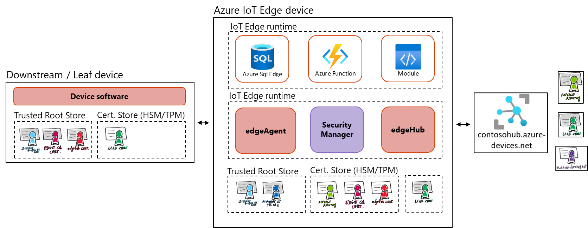
</td>
</tr>
<tr class="odd">
<td>Check telemetry sent</td>
<td>
<strong>$ sudo iotedge logs SimulatedTemperatureSensor
-f</strong>

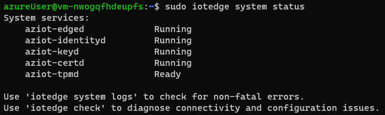
</td>
</tr>
<tr class="odd">
<td>Now use the ‘iotedge check’ command to verify the connectivity and
production readiness of this IoT Edge device:</td>
<td>
<strong>$ sudo iotedge check</strong>

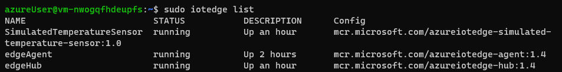
</td>
</tr>
</tbody>
</table>

The *check* command returns the list of verifications executed, and for
those that do not pass the checks, it provides detailed guidance
pointers. You can identify 4 warnings and its corresponding doc
pointers:

- DSN Server: <https://aka.ms/iotedge-prod-checklist-dns>

- Production readiness: logs policy:
  <https://aka.ms/iotedge-prod-checklist-logs>

- Production readiness: Edge Agent's storage directory is persisted on
  the host filesystem: <https://aka.ms/iotedge-storage-host>

- Production readiness: Edge Hub's storage directory is persisted on the
  host filesystem: <https://aka.ms/iotedge-storage-host>

The first warning points to the lack of configuration of DNS server,
which is highly recommended to improve robustness as not having a proper
DNS resolution could prevent the edgeAgent from properly downloading the
configuration file for the edge device. The resolution is explained in
the following reference [Troubleshoot Azure IoT Edge common errors \|
Microsoft
Learn](https://learn.microsoft.com/en-gb/azure/iot-edge/troubleshoot-common-errors?view=iotedge-1.4#edge-agent-module-reports-empty-config-file-and-no-modules-start-on-the-device).

The second issue spots that your docker container is using the default
logging configuration, which would result exhausting your edge device
storage. To avoid this situation, you can follow the guidance for
[Setting up default logging
driver](https://learn.microsoft.com/azure/iot-edge/production-checklist?view=iotedge-2020-11#set-up-default-logging-driver).

Finally, the last two are the same issue, related to the fact that the
edgeAgent and edgeHub modules is not configured to use the host
filesystem, which is the recommendation. Following the doc pointer we
end up in the following documentation: [Use IoT Edge device local
storage from a module - Azure IoT Edge \| Microsoft
Learn](https://learn.microsoft.com/en-us/azure/iot-edge/how-to-access-host-storage-from-module?view=iotedge-1.4).

Now, following the guidance provided, we are going to fix each of the
identified issues.

<table>
<colgroup>
<col style="width: 24%" />
<col style="width: 75%" />
</colgroup>
<thead>
<tr class="header">
<th colspan="2">
Step by step instructions:
</th>
</tr>
</thead>
<tbody>
<tr class="odd">
<td colspan="2">
DNS &amp; Logs Policies:

These issues can be fixed by adjusting the global configuration for
the container engine or by specifying the configuration for each of the
modules by using the createOptions (container create options) in the
deployment manifest. We are going to use the global approach.
</td>
</tr>
<tr class="even">
<td>Add or edit a <em>daemon.json</em> file in the <em>/etc/docker</em>
directory.</td>
<td>
<strong>$ sudo vi /etc/docker/daemon.json</strong>

</td>
</tr>
<tr class="odd">
<td>Add the following content to define the DNS and local logging driver
configuration.</td>
<td></td>
</tr>
<tr class="even">
<td>Restart the container engine for the updates to take effect.</td>
<td>
<strong>$ sudo systemctl restart docker</strong>

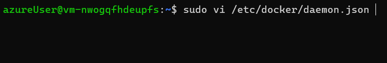
</td>
</tr>
<tr class="odd">
<td colspan="2">
Modules storage configuration:

We will be configuring the modules to use the host storage. To do so
we need to prepare the host folders we will be using and, then, set up
the modules configuration in the deployment manifest.
</td>
</tr>
<tr class="even">
<td>Create host folders.</td>
<td>
<strong>$ mkdir /tmp/edgeAgent</strong>

<strong>$ mkdir /tmp/edgeAgent</strong>

<strong>$ mkdir /tmp/tempSensor</strong>
</td>
</tr>
<tr class="odd">
<td>The system modules do not require permissions handling as per the
automatic <a
href="https://learn.microsoft.com/azure/iot-edge/how-to-access-host-storage-from-module?view=iotedge-1.4#automatic-host-system-permissions-management">system
permission management</a>, but you need to <a
href="https://learn.microsoft.com/azure/iot-edge/how-to-access-host-storage-from-module?view=iotedge-1.4#host-system-permissions">set
the correct permissions</a> for the TemperatureModule folder.</td>
<td>
<strong>$ sudo chown 1000 /tmp/tempSensor</strong>

<strong>$ sudo chmod 700 /tmp/tempSensor</strong>
</td>
</tr>
<tr class="even">
<td>Now, from the Azure Porta, open the edge device configuration and
click on “Set Modules”.</td>
<td>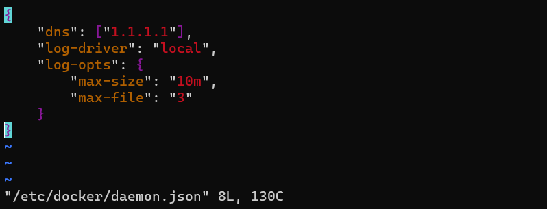</td>
</tr>
<tr class="odd">
<td>Click on “Runtime Settings” to provide the configuration for the
Edge Agent and Edge Hub modules.</td>
<td>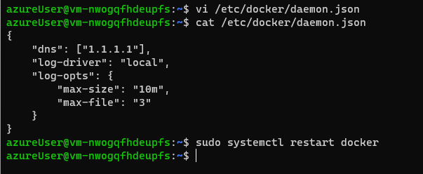</td>
</tr>
<tr class="even">
<td>For the Edge Agent, define the <em>storageFolder</em> environment
variable pointing to the module storage path <em>/tmp/storage</em></td>
<td>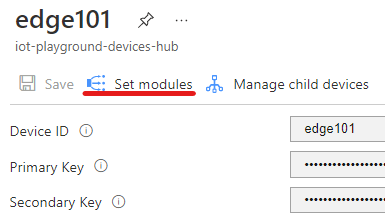</td>
</tr>
<tr class="odd">
<td>Now define the Container Create Options to bind the module storage
path to the host storage folder.</td>
<td>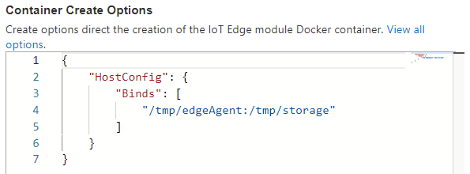</td>
</tr>
<tr class="even">
<td>Repeat the steps for the Edge Hub. First, the environment variable
pointing to the local storage path.</td>
<td></td>
</tr>
<tr class="odd">
<td>
Now the Container Create Options to bind the module and host
storage folders.

In this case, the edgeHub contains some predefined configuration, be
careful to preserve the document correctness.
</td>
<td>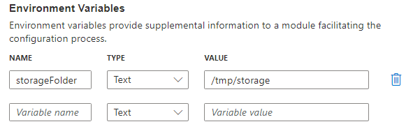</td>
</tr>
<tr class="even">
<td>Apply the changes.</td>
<td></td>
</tr>
<tr class="odd">
<td>Now, we will configure the TemperatureSensor module.</td>
<td>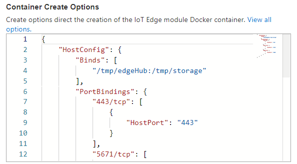</td>
</tr>
<tr class="even">
<td>Define the environment variable.</td>
<td></td>
</tr>
<tr class="odd">
<td>And the Container Create Options.</td>
<td>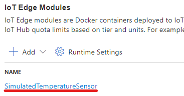</td>
</tr>
<tr class="even">
<td>Apply the changes again.</td>
<td></td>
</tr>
<tr class="odd">
<td>We are not going to change any route, so you can go directly to
“Review + create” step</td>
<td></td>
</tr>
<tr class="even">
<td>We can review the deployment manifest. And then create the
deployment.</td>
<td>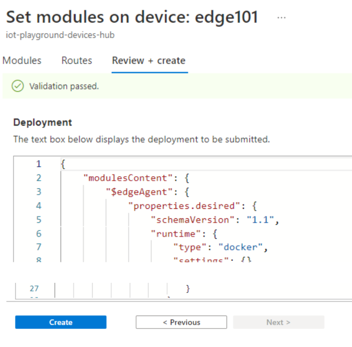</td>
</tr>
<tr class="odd">
<td>After few moments, the configurations will be applied in the device,
so we can execute again the ‘iotedge check’ command.</td>
<td>
<strong>$ sudo iotedge check</strong>

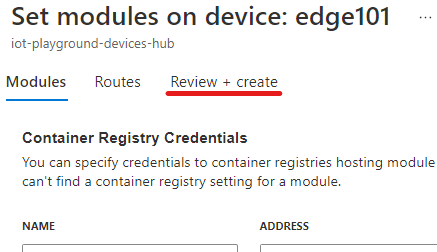
</td>
</tr>
<tr class="even">
<td colspan="2">In the output of the command, we see the warnings
removed. The only warning left is related to verification of the MQTT
protocol connectivity which is not currently in use.</td>
</tr>
</tbody>
</table>

## Appendix: Helpful tooling

Here are some tools that would help you design, test, and troubleshoot
IoT Solutions in general and IoT Edge devices.

<table>
<colgroup>
<col style="width: 50%" />
<col style="width: 50%" />
</colgroup>
<thead>
<tr class="header">
<th>
<strong>Azure IoT Explorer</strong>

The Azure IoT explorer is a graphical tool for interacting with
devices connected to your IoT hub. [Linux / Windows]
</th>
<th><a
href="https://learn.microsoft.com/en-us/azure/iot-fundamentals/howto-use-iot-explorer">Install
and use Azure IoT explorer | Microsoft Learn</a></th>
</tr>
</thead>
<tbody>
<tr class="odd">
<td>
<strong>Service Bus Explorer</strong>

The Service Bus Explorer allows users to connect to a Service Bus
namespace. The tool provides advanced features like import/export
functionality or the ability to test topic, queues, subscriptions, relay
services, notification hubs and events hubs. [Windows]
</td>
<td><a
href="https://github.com/paolosalvatori/ServiceBusExplorer">Service Bus
Explorer OSS tool</a></td>
</tr>
<tr class="even">
<td>
<strong>Azure IoT Tools for Visual Studio Code</strong>

Microsoft Azure IoT support for Visual Studio Code is provided
through a rich set of extensions that make it easy to discover and
interact with Azure IoT Hub that power your IoT Edge and device
applications.
</td>
<td><a
href="https://marketplace.visualstudio.com/items?itemName=vsciot-vscode.azure-iot-tools">Azure
IoT Tools - Visual Studio Marketplace</a></td>
</tr>
<tr class="odd">
<td>
<strong>Mostquitto pub/sub</strong>

MQTT testing cli tools to publish and subscribe messaging based on
MQTT protocol. Part of the Eclipse Mosquito MQTT broker.
[Linux/Windows]
</td>
<td><a href="https://mosquitto.org/download/">Download | Eclipse
Mosquitto</a></td>
</tr>
<tr class="even">
<td>
<strong>MQTT TUI</strong>

Terminal User Interface to subscribe and publish MQTT messages over
terminal. [Linux]
</td>
<td><a href="https://github.com/EdJoPaTo/mqttui">MQTT TUI: Subscribe to
a MQTT Topic or publish something quickly from the terminal</a></td>
</tr>
<tr class="odd">
<td>
<strong>Azure IoT Device Telemetry Simulator</strong>

The IoT Telemetry Simulator allows you to test Azure IoT Hub, Event
Hub or Kafka ingestion at scale. The implementation is communicating
with Azure IoT Hub using multiplexed AMQP connections. An automation
library allows you to run it as load test as part of a CI/CD pipeline.
[Linux/Windows]
</td>
<td><a
href="https://learn.microsoft.com/en-us/samples/azure-samples/iot-telemetry-simulator/azure-iot-device-telemetry-simulator/">Azure
IoT Device Telemetry Simulator - Code Samples | Microsoft Learn</a></td>
</tr>
</tbody>
</table>

[^1]: In the case of considering self-signed root CA certificate in
    production environments, hence, self-signed certificates to manage
    your device fleet, beware that you are responsible on your own for
    the secure storing, custody, and managing of this important security
    element.
