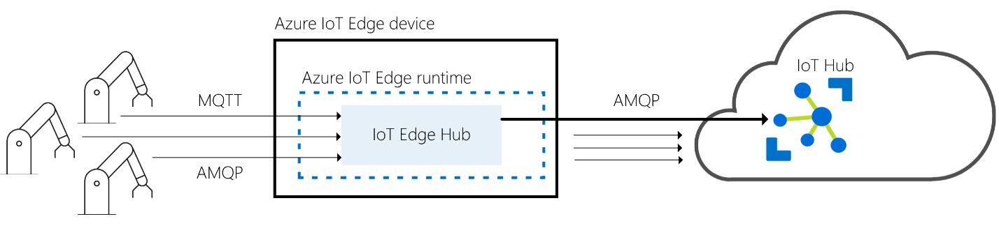
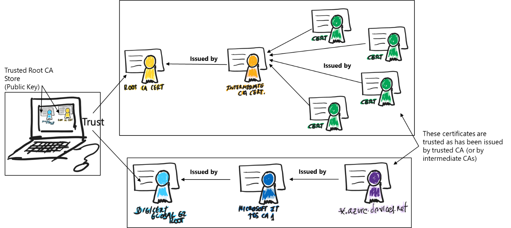
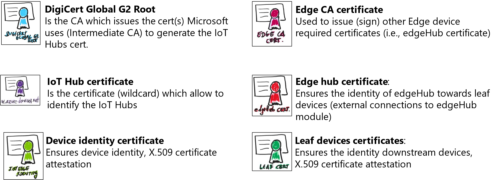
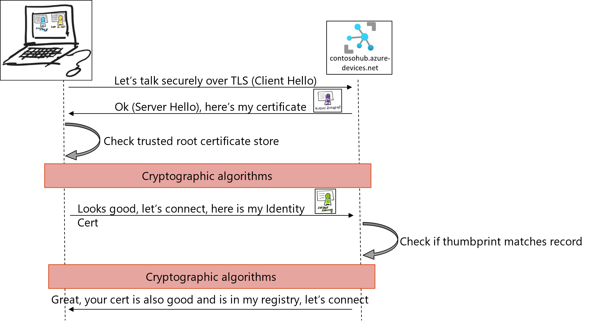

# What is Azure IoT Edge
{: .no_toc }

  

    Table of contents
  

  {: .text-delta }
- TOC
{:toc}

IoT solutions can require some capabilities implemented by intelligent
devices at edge, assisting in tasks like device provisioning, data
filtering, batching and aggregation, buffering of data, protocol
translation, event rules processing, leveraging ML & AI at edge, and
more. These Intelligent Edge Devices serve an active role in managing
access and information flow. Azure IoT Edge can be used for these
on-premises needs. Azure IoT Edge also offers an extensible model for
enabling custom functionality through Edge modules.

Azure IoT Edge extends IoT Hub capabilities and moves cloud analytics
and custom business logic to devices so that your organization can focus
on business insights instead of data management. Scale out your IoT
solution by packaging your business logic into standard containers, then
you can deploy those containers to any of your devices and monitor it
all from the cloud.

## Intelligent edge devices

As mentioned, intelligent devices are meant to cover different kinds of
scenarios:

- **Cleaning and aggregating data locally**, sending only insights to
  the cloud with the corresponding cost savings and bandwidth reduction.

- Ability to **work offline or under intermittent network conditions**,
  [providing *store and forward* and extended offline
  capabilities.](https://learn.microsoft.com/azure/iot-edge/offline-capabilities)

- Running
  **[analytics](https://learn.microsoft.com/azure/iot-edge/tutorial-deploy-stream-analytics)
  and [Machine
  Learning](https://learn.microsoft.com/azure/iot-edge/tutorial-machine-learning-edge-01-intro)**
  modules over an events stream in near real-time.

- Quick **response to events** on-premises (no cloud roundtrips).

- Act as **field gateways**, allowing to implement different [gateway
  patterns](https://learn.microsoft.com/azure/iot-edge/iot-edge-as-gateway)
  such as transparent gateways, protocol translation gateways, and / or
  identity translation gateways.

Azure IoT Edge provides a modular architecture allowing the
implementation of any combination of the above scenarios within the same
Intelligent Edge Device.

## Azure IoT Edge components

There are two main components in the Azure IoT Edge:

- **IoT Edge modules** are containers that run Azure services,
  third-party services, or your own code. Modules are deployed to IoT
  Edge devices and execute locally on those devices.

- The **IoT Edge runtime** runs on each IoT Edge device and manages the
  modules deployed to each device.

## IoT Edge Modules

IoT Edge modules are units of execution, **implemented as Docker
compatible containers**, that run your business logic at the edge.
Multiple modules can be configured to communicate with each other,
creating a pipeline of data processing. You can develop custom modules
or package certain Azure services into modules that provide insights
offline and at the edge.

### Artificial Intelligence at the edge

Azure IoT Edge allows you to deploy complex event processing, machine
learning, image recognition, and other high value AI without writing it
in-house. Azure services like Azure Functions, Azure Stream Analytics,
and Azure Machine Learning can all be run on-premises via Azure IoT
Edge. You're not limited to Azure services, though. Anyone can create AI
modules and make them available to the community for use through the
Azure Marketplace.

### Bring your own code

When you want to deploy your own code to your devices, Azure IoT Edge
supports that, too. Azure IoT Edge holds to the same programming model
as the other Azure IoT services. You can run the same code on a device
or in the cloud. Azure IoT Edge supports both Linux and Windows so you
can code to the platform of your choice. It supports Java, .NET Core,
Node.js, C, and Python so your developers can code in a language they
already know and use existing business logic.

## The IoT Edge Runtime

You can think about the IoT Edge runtime as the system responsible of
ensuring the IoT Edge modules are being executed properly and securely
executed in the edge device, as well as taking care of the device
identity and communications with the corresponding IoT Hub.

An Azure IoT Edge device can be any host that can execute the IoT Edge
Runtime. It supports both Windows and Linux operating systems. Depending
on your processing requirements it can be an industrial server, a
regular computer or PC or a smaller device (like a Raspberry Pi). The
way you use an Azure IoT Edge device is up to you.

The runtime performs several functions:

- Installs and update workloads on the device.

- Maintains Azure IoT Edge security standards on the device.

- Ensures that IoT Edge modules are always running.

- Reports module health to the cloud for remote monitoring.

- Manages communication between downstream leaf devices and an IoT Edge
  device, between modules on an IoT Edge device, and between an IoT Edge
  device and the cloud.

For more details, you can review the [official
documentation](https://learn.microsoft.com/en-us/azure/iot-edge/about-iot-edge).

The responsibilities of the IoT Edge runtime fall into two categories:
communication and module management. These two roles are performed by
two components that are part of the IoT Edge runtime. The *IoT Edge
Agent* deploys and monitors the modules, while the *IoT Edge Hub* is
responsible for communication.

### IoT Edge Agent

The IoT Edge Agent is the system module responsible for instantiating
the modules that need to be executed in the edge device to achieve its
goals. For example, we can develop a custom module to process the values
from a temperature sensor and send data to the cloud to track the
average temperature as well as to send an alert if the temperature
passes a certain threshold. IoT Edge Agent will take care of
instantiating the custom module, ensure it continues to run and report
the status to the IoT Hub.

IoT Edge Agent is initiated by the IoT Edge security daemon which is
installed within the computer / host. The agent retrieves its module
twin from IoT Hub and inspects the ***deployment manifest***. The
deployment manifest is a JSON file that declares the modules that need
to be started within this edge device.

Another important aspect of the IoT Edge Agent is the role it plays in
the security of an IoT Edge device, it performs actions like verifying a
module’s image before starting.

#### Deployment Manifest

The deployment manifest details the modules which need to be started
within the edge device and its configuration. Each IoT Edge device runs
at least two modules: \$edgeAgent and \$edgeHub, which are part of its
runtime. Use a deployment manifest to tell your device which modules to
install and how to configure them to work together.

The *deployment manifest* is a JSON document that describes:

- The **IoT Edge agent** module twin, which includes three components:

  - The container image for each module that runs on the device.

  - The credentials to access private container registries that contain
    module images.

  - Instructions for how each module should be created and managed.

- The **IoT Edge hub** module twin, which includes how messages flow
  between modules and eventually to IoT Hub.

  - The desired properties of any additional module twins (optional).

The deployment manifest is defined and stored at the IoT Hub side. Once
the IoT Edge runtime is installed and configured, the runtime downloads
the \$edgeAgent module and starts it. The \$edgeAgent module connects to
the IoT Hub and downloads its deployment manifest to finally set up the
IoT Edge device. The deployment manifest is encrypted at rest to protect
the credentials to access private registries that contain module images.

To manage and configure modules on a large number of IoT Edge devices we
can use IoT Edge automatic deployments. [IoT Edge automatic
deployments](https://learn.microsoft.com/azure/iot-edge/module-deployment-monitoring?view=iotedge-1.4)
configure sets of IoT Edge devices to run IoT Edge modules. Each
deployment continuously ensures that all matching devices are running
the specified set of modules, even when new devices are created or are
modified to match the target condition

For further details regarding the deployment manifest, check [Deploy
module & routes with deployment manifests - Azure IoT Edge \| Microsoft
Learn](https://learn.microsoft.com/en-us/azure/iot-edge/module-composition?view=iotedge-1.4)

### IoT Edge Hub

This system module acts as a local proxy for the IoT Hub by exposing the
same protocol endpoints as IoT Hub (it is not a full version of it
running locally), so leaf devices can connect to the IoT Edge runtime
just as they would to IoT Hub (imagine a factory where leaf devices
connect to edge devices acting as a transparent gateways).

IoT Edge hub module silently delegates some tasks to the IoT Hub, for
example, the authorization information from IoT Hub is downloaded on its
first connection to enable a leaf device to connect, after the first
connection, the authorization information is cached locally by the IoT
Edge hub. There are two types of communication the IoT Edge hub takes
care about, cloud communication and local communication.

#### Cloud communication

IoT Edge hub can use either AMQP or MQTT protocols to communicate
upstream with the cloud. When using AMQP protocol from IoT Edge hub to
connect to the IoT Hub, logical leaf devices connections can be combined
into a single physical connection by using the AMPQ multiplexing
capabilities. AMQP is the default upstream protocol.

#### Local Communication

IoT Edge facilitates local communication. It enables device-to-module
communication for leaf devices and module-to-module communications by
brokering messages to keep devices and modules independent of each
other.

#### Connecting to IoT Edge Hub

IoT Edge Hub accepts connections from leaf devices or other Azure IoT
Edge devices (nested edge). IoT Edge hub supports clients that connect
using MQTT or AMQP. It does not support clients that use HTTP.

When a client connects to the IoT Edge hub, the following happens:

1.  If the Transport Security Layer is enabled (default), a TLS channel
    is established.

2.  Authentication information is sent from the client to the IoT Edge
    hub to identify itself.

3.  IoT Edge authorizes or rejects the connection based on its
    authorization policy.

To build the TLS channel, during the TLS handshake, the IoT Edge hub
sends its certificate chain that the client needs to validate. If the
client does not trust the IoT Edge root certificate, the connection will
be rejected. In other words, the device clients need to have installed
the IoT Edge hub root certificate to be able to connect.

Regarding authentication, the IoT Edge hub only accepts connections from
devices or modules that have an IoT Hub identity. The authorization is
determined by verifying the client belongs to its set of trusted
clients. The set of trusted clients is defined in IoT Hub by setting up
parent-child relationships (for devices) or device-module relationships
(for modules).

### IoT Edge Security Manager

The Azure IoT Edge security manager is a well-bounded security core for
protecting the IoT Edge device and all its components.

The IoT Edge Security Manager has an IoT Edge module runtime,
responsible for the logical security operations of the security manager.
It represents a significant portion of the trusted computing base of the
IoT Edge device. The module runtime uses security services from the
[Azure IoT Identity
Service](https://azure.github.io/iot-identity-service/), which is in
turn hardened by the device manufacturer's choice of hardware security
module (HSM).

Among other responsibilities, the IoT Edge Security manager takes care
of IoT Edge agent bootstrapping as well as provides an abstraction layer
for the security operations required for the IoT Edge device (accessing
the container registry, connecting to IoT Hub, registering the device
with Device Provisioning Service, accessing to the TPM or HSM…)

## IoT Edge and certificates

This is one of the most complex topics when dealing with IoT platforms
and IoT Edge in production contexts. Before exploring how IoT Edge uses
X.509 certificates, let’s explore two important concepts:

- **Root CA certificate:** a root Certificate Authority (CA) certificate
  is the root of trust of the entire process. In production scenarios,
  this CA certificate is usually purchased from a trusted commercial
  certificate authority (CA) like Baltimore, Verisign, or DigiCert. Root
  CA certificates allow Intermediate CA certificates. For example, the
  certificate used to identify the IoT Hubs is generated by an
  Intermediate CA generated using a well know commercial CA: Baltimore
  CyberTrust Root CA.

- **Intermediate Certificates:** In a typical manufacturing process for
  creating secure devices, root CA certificates are rarely used
  directly, primarily because of the risk of leakage or exposure. The
  root CA certificate creates and digitally signs one or more
  intermediate CA certificates for segmentation and blast radius damage
  control.

Using Root CA certs and Intermediate CAs create a certificate trust
chain, where a certain device or machine which trust a Root CA or an
Intermediate CA then trust the certificates that has been generated
using that Root CA or the Intermediate CAs, creating a trust chain:  

There are different certificates used by an IoT Edge device:

IoT Edge uses X.509 certificates in two different ways:

- **IoT Edge Identity Certificates**: an IoT Edge Device can use a
  device identity certificate to probe their identity and authenticate
  to the IoT Hub, this is what is called [X.509 certificate
  attestation](https://learn.microsoft.com/azure/iot-edge/how-to-provision-single-device-linux-on-windows-x509?view=iotedge-1.4&tabs=azure-portal%2Cpowershell).
  In this case, you create two X.509 identity certificates (to enable
  certificate rotation) and place them on the device. When you create a
  new device identity in IoT Hub, you provide thumbprints from both
  certificates. When the device authenticates to IoT Hub, it presents
  one certificate and IoT Hub verifies that the certificate matches its
  thumbprint. The following picture describes the interaction between
  the Edge device and the IoT Hub:

- **IoT Edge Certificates:** these are used by the modules and
  downstream IoT devices to verify the identity and legitimacy of
  the IoT Edge hub runtime module. These verifications enable a TLS
  (transport layer security) secure connection between the runtime, the
  modules, and the IoT devices. Like IoT Hub itself, IoT Edge requires a
  secure and encrypted connection from IoT downstream (or leaf) devices
  and IoT Edge modules. To establish a secure TLS connection, the IoT
  Edge hub module presents a server certificate chain to connecting
  clients for them to verify its identity. There are four types of
  certificates used by IoT Edge:

  - **Edge CA Certificate**: each IoT Edge device needs an edge CA
    Certificate, which should be stored in a secure storage such as a
    hardware security module. The edge CA certificate is generated from
    and signed by the final intermediate CA certificate in the process.
    The edge CA certificate uniquely identifies the IoT Edge device. The
    edge CA certificate can sign other certificates, like the IoT Edge
    hub server certificate. This allows you to you have complete control
    over the devices connecting to your IoT Edge devices, it's possible
    to use a corporate level certificate authority (or even a
    self-signed CA[^1]).

  - **The IoT Edge hub server certificate**: The IoT Edge hub server
    certificate is the actual certificate presented to leaf devices and
    modules for identity verification during establishment of the TLS
    connection required by IoT Edge. This certificate presents the full
    chain of signing certificates used to generate it up to the root CA
    certificate, which the leaf IoT device must trust. When generated by
    IoT Edge, the common name (CN), of this IoT Edge hub certificate is
    set to the 'hostname' property in the config file after conversion
    to lower case.

For detailed information, check [Understand how IoT Edge uses
certificates for security \| Microsoft
Learn](https://learn.microsoft.com/en-us/azure/iot-edge/iot-edge-certs?view=iotedge-1.4).

## Azure IoT Edge supported systems

Azure IoT Edge can run great on different devices as small as a
Raspberry Pi3 to server grade hardware. There are multiple dependencies
and considerations you need to have in mind when setting up an Azure IoT
Edge device.

IoT Edge modules are implemented as containers, so IoT Edge needs a
container engine to launch them. Microsoft provides a container engine,
moby-engine, to fulfill this requirement, and takes care of its
evolution and maintenance. This container engine is based on Moby
open-source project. Other popular container engines, also based on Moby
open-source projects, are compatible with Azure IoT Edge. Microsoft
recommends using moby-engine on production systems to provide best class
support.

Azure IoT Edge runs on most operating systems that can run containers
including both Linux and Windows, however, not all these systems are
equally supported. Operating systems are grouped into tiers that
represent the level of support users can expect.

- Tier 1: systems that are supported, Microsoft have automated tests
  using these platforms and provides installation packages for them.

- Tier 2: systems that are compatible with Azure IoT Edge and can be
  used relatively easily. Microsoft has done informal testing on these
  platforms or knows of a partner successfully running Azure IoT Edge on
  the platform.

IoT Edge also can run on Virtual Machines and is agnostic of the
underlaying virtualization technology. [IoT Edge for Linux on
Windows](https://learn.microsoft.com/en-us/azure/iot-edge/iot-edge-for-linux-on-windows?view=iotedge-1.4)
uses IoT Edge in a Linux virtual machine running on a Windows host. In
this way, you can run Linux modules on a Windows device.

For further details, check [Supported operating systems, container
engines - Azure IoT Edge \| Microsoft
Learn](https://learn.microsoft.com/azure/iot-edge/support?view=iotedge-1.4)

## Show IoT Edge in action

After reviewing the base concepts, let’s jump into the creation of an
IoT Edge device. There are four main steps you need to follow to create
an Azure IoT Edge:

1.  Create an IoT Hub (if you already don’t have one).

2.  Register an IoT Edge device into your IoT Hub.

3.  Install and start the IoT Edge runtime on a certain host, for
    example a virtual or physical machine.

4.  Set the IoT Edge device modules, that is, configure the deployment
    manifest, by adding an existing module from the marketplace (there
    is a Simulated Temperature Sensor available).

Follow the quick start sample in the official documentation which
contains detailed instructions to setup your first IoT Edge device:
[Quickstart create an Azure IoT Edge device on Linux \| Microsoft
Learn](https://learn.microsoft.com/azure/iot-edge/quickstart-linux?view=iotedge-1.4)