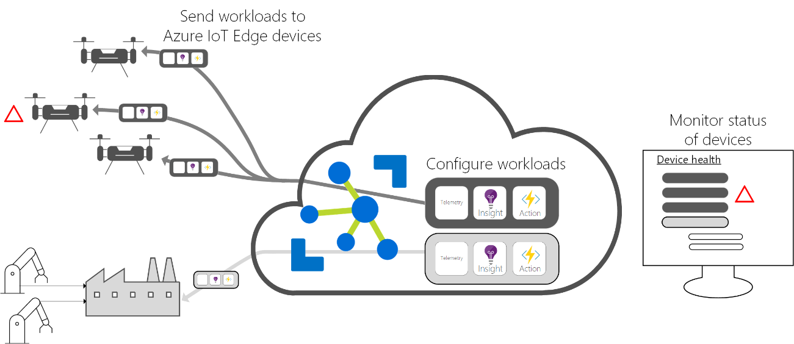
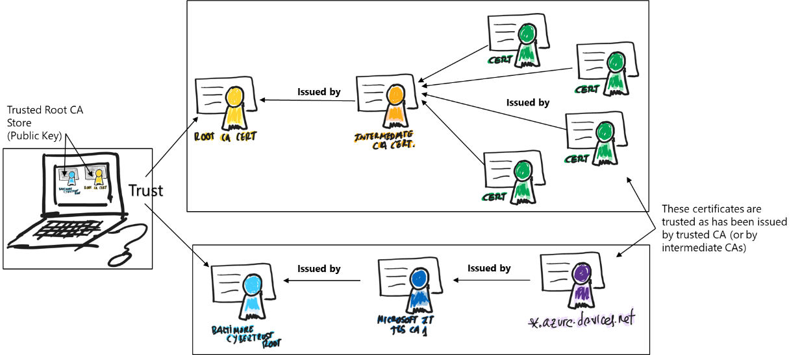
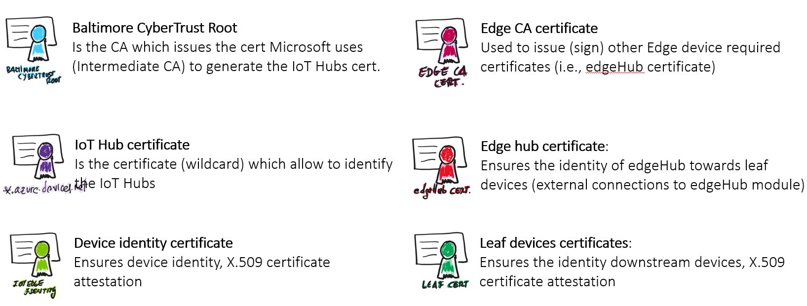
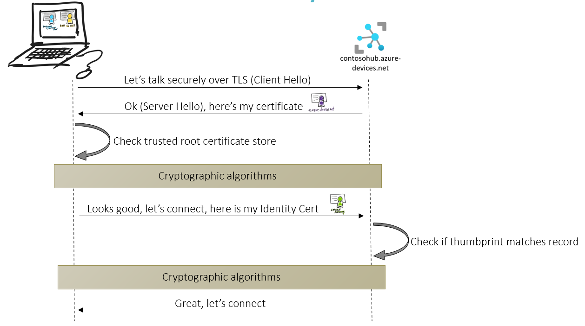
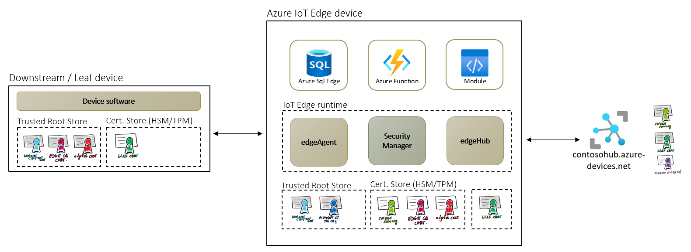
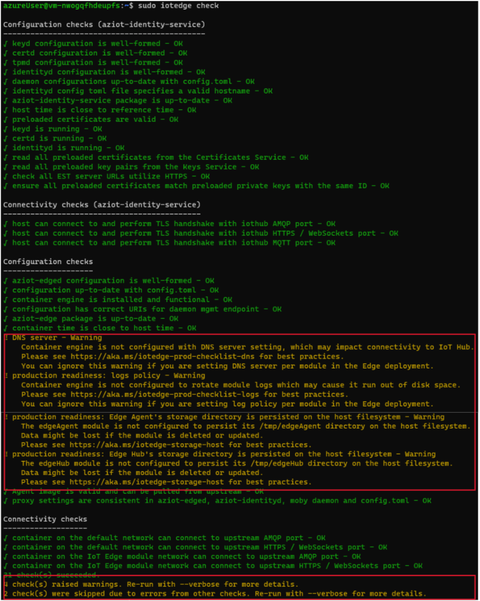
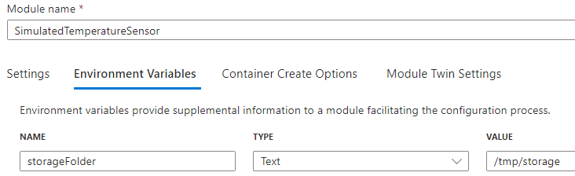

# Azure IoT Edge 101

[Introduction](#introduction)

[IoT Concepts](#iot-concepts)

[What is Azure IoT Edge](#what-is-azure-iot-edge)

* [Intelligent edge devices](#intelligent-edge-devices)

* [Azure IoT Edge components](#azure-iot-edge-components)

* [IoT Edge Modules](#iot-edge-modules)

* [The IoT Edge Runtime](#the-iot-edge-runtime)

* [IoT Edge and certificates](#iot-edge-and-certificates)

* [Azure IoT Edge supported systems](#azure-iot-edge-supported-systems)

* [Show IoT Edge in action](#show-iot-edge-in-action)

[Create and manage IoT Edge devices](#create-and-manage-iot-edge-devices)

* [Choose your target platform](#choose-your-target-platform)

* [Device setup and provisioning](#device-setup-and-provisioning)

* [Limits and restrictions](#Limits-and-restrictions)

* [Custom Modules](#custom-modules)

* [Offline Capabilities](#offline-capabilities)

* [Production deployment checklist](#production-deployment-checklist)

[Sample: Check your IoT Edge device production readiness](#sample-check-your-iot-edge-device-production-readiness)

[Appendix: Helpful tooling](#appendix-helpful-tooling)

# Introduction

Azure IoT Edge provides edge computing capabilities to provide edge
intelligence to your IoT solutions. The following document is a
compilation of the existing Azure IoT Edge documentation, references,
and concepts. This document was created with the assumption of no
previous experience and focuses to ease the understanding around Azure
IoT Edge and facilitate the journey to production for IoT architects,
developers, and operators.

If you already have experience with IoT Edge concepts and architecture,
and you are looking for more production grade guidance, you can jump
directly to the “[Create and manage IoT Edge
devices](#_Create_and_manage)” section.

# IoT Concepts

Before going into details with Azure IoT Edge, Let’s do a quick review
of some [IoT
Concepts](https://learn.microsoft.com/azure/iot-hub/iot-concepts-and-iot-hub).

IoT applications or solutions can be described as Things (or devices),
sending data or events that are used to generate Insights. These
insights are used to generate Actions to help improve a business or
process. An example is an engine (a thing), sending pressure and
temperature data that is used to evaluate whether the engine is
performing as expected (an insight), which is used to proactively
prioritize the maintenance schedule for the engine (an action).

To implement an IoT solution the Azure IoT platform provides you with
multiple services and different capabilities. We will have *IoT devices*
(also known as *downstream devices*), which will have their own
*identity*. The device identity is generated by registering the device
into *Azure IoT Hub*. You can register devices into IoT Hub manually, or
at scale by using the *Device Provisioning Service*. Devices use their
identity to authenticate and communicate with IoT hub. Devices (usually)
send *telemetry*, have *properties* which describe their state, and
respond to *commands* which correspond to their capabilities. The
devices have their properties stored in a device twin in the device
registry. Let’s have a detailed review of the previous IoT concepts:

- **Azure IoT Hub:** Azure IoT Hub is a managed service hosted in the
  cloud that acts as a central message hub for communication between an
  IoT application and its attached devices. You can connect millions of
  devices and their backend solutions reliably and securely. Almost any
  device can be connected to an IoT hub.

- **Device Provisioning Service (DPS):** The IoT Hub Device Provisioning
  Service (DPS) is a helper service for IoT Hub that enables zero-touch,
  just-in-time provisioning to the right IoT hub without requiring human
  intervention. DPS enables the provisioning of millions of devices in a
  secure and scalable manner.

- **IoT Device:** Virtual or physical IoT devices (things) differ from
  other clients such as browsers and mobile apps, specifically, they are
  often embedded systems with reduced or no human operator, can be
  deployed in remote -often inaccessible- locations, might only be
  reachable through the solution back-end, might have limited power and
  processing resources, usually have attached some sensors, might have
  intermittent, slow, or expensive network connectivity and might need
  to use proprietary, custom or industry-specific application protocols.

- **IoT Edge Device**: And edge device is a special type of device that
  usually provides dedicated edge computing capabilities such as data
  pre-processing and analysis, offline capabilities, bandwidth
  consumption optimization, etc. Azure IoT Edge provides a
  device-focused runtime that enables you to deploy, run, and monitor
  containerized Linux workloads. IoT Edge devices are also downstream
  devices from the point of view of IoT Hub.

- **Downstream device:** A downstream device can be any application or
  platform that has an identity created with the Azure IoT Hub cloud
  service. In many cases, these applications use the Azure IoT device
  SDK. A downstream device could even be an application running on the
  IoT Edge gateway device itself. In the context of the IoT Edge and
  transparent gateways, the downstream devices that connects to IoT Hub
  thru IoT Edge are sometimes called leaf devices or child devices.

- **Device Identity Registry and Authentication:** Every IoT Hub has an
  identity registry that stores information about the devices and
  modules permitted to connect to it. Before a device or module can
  connect, there must be an entry for that device or module in the IoT
  hub's identity registry. A device or module authenticates with the IoT
  hub based on credentials stored in the identity registry.

  The IoT Hub supports two methods of authentication between the device
and the IoT Hub: SAS token-based authentication or X.509 certificate
authentication.

- **Device Communication:** IoT Hub uses Transport Layer Security (TLS)
  to secure connections from IoT devices and services. Three versions of
  the TLS protocol are currently supported, namely versions 1.0, 1.1,
  and 1.2. TLS 1.0 and 1.1 are considered legacy and are planned for
  [deprecation](https://learn.microsoft.com/azure/iot-hub/iot-hub-tls-deprecating-1-0-and-1-1).

      Typically, IoT devices send telemetry from the sensors to back-end
services in the cloud. However, other types of communication are
possible, such as a back-end service sending commands to your devices.

- **Device Telemetry:** Examples of telemetry received from a device can
  include sensor data such as speed or temperature, an error message
  such as missed event, or an information message to indicate the device
  is in good health. IoT devices send events to an application to gain
  insights. Applications may require specific subsets of events for
  processing or storage at different endpoints.

- **Device Properties:** Properties can be read or set from the IoT hub
  and can be used to send notifications when an action has been
  completed. An example of a specific property on a device is
  temperature. Temperature can be a writable property that can be
  updated on the device or read from a temperature sensor attached to
  the device.

- **Device Commands:** An example of a command is rebooting a device.
  IoT Hub implements commands by allowing you to invoke direct methods
  on devices. Direct methods represent a request-reply interaction with
  a device similar to an HTTP call in that they succeed or fail
  immediately (after a user-specified timeout). This approach is useful
  for scenarios where the course of immediate action is different
  depending on whether the device was able to respond.

- **Device Twins:** *Device twins* are JSON documents that store device
  state information including metadata, configurations, and conditions.
  Azure IoT Hub maintains a device twin for each device that you connect
  to IoT Hub, no matter if it is an edge device or a regular one.

- **Desired Properties and Reported Properties:** Are used to
  synchronize device configuration or conditions, the **solution backend
  can set the desired properties** and the device software can read them
  or receive notifications of its changes; once the device software
  synchronizes its state with the desired properties, the **device set
  the reported properties** accordingly, so the solution backend can
  read them or received the notifications.

    For further information, see [Understand Azure IoT Hub device twins \|
Microsoft
Learn](https://learn.microsoft.com/azure/iot-hub/iot-hub-devguide-device-twins)

- **Module Twins:** In IoT Hub, under each device identity, you can
  create up to 50 module identities. Each module identity implicitly
  generates a module twin. Like device twins, module twins are JSON
  documents that store module state information including metadata,
  configurations, and conditions. Azure IoT Hub maintains a module twin
  for each module that you connect to IoT Hub, no matter if it is an
  edge device or a regular one.

    For further information, see [Understand Azure IoT Hub module twins \|
Microsoft
Learn](https://learn.microsoft.com/azure/iot-hub/iot-hub-devguide-module-twins)

- **D2C and C2D:** These acronyms are widely used in IoT Solutions
  context. D2C refers to the communications originated at the devices
  which flows to the cloud (usually device telemetry or device reported
  properties), while C2D follows the contrary path, that is,
  communications originated at the cloud which flows to the devices
  (usually representing device commands or device desired properties).

# What is Azure IoT Edge

IoT solutions can require some capabilities implemented by intelligent
devices at edge, assisting in tasks like device provisioning, data
filtering, batching and aggregation, buffering of data, protocol
translation, event rules processing, leveraging ML & AI at edge, and
more. These Intelligent Edge Devices serve an active role in managing
access and information flow. Azure IoT Edge can be used for these
on-premises needs. Azure IoT Edge also offers an extensible model for
enabling custom functionality through Edge modules.

Azure IoT Edge extends IoT Hub capabilities and moves cloud analytics
and custom business logic to devices so that your organization can focus
on business insights instead of data management. Scale out your IoT
solution by packaging your business logic into standard containers, then
you can deploy those containers to any of your devices and monitor it
all from the cloud.

## Intelligent edge devices

As mentioned, intelligent devices are meant to cover different kinds of
scenarios:

- **Cleaning and aggregating data locally**, sending only insights to
  the cloud with the corresponding cost savings and bandwidth reduction.

- Ability to **work offline or under intermittent network conditions**,
  [providing *store and forward* and extended offline
  capabilities.](https://learn.microsoft.com/azure/iot-edge/offline-capabilities)

- Running
  **[analytics](https://learn.microsoft.com/azure/iot-edge/tutorial-deploy-stream-analytics)
  and [Machine
  Learning](https://learn.microsoft.com/azure/iot-edge/tutorial-machine-learning-edge-01-intro)**
  modules over an events stream in near real-time.

- Quick **response to events** on-premises (no cloud roundtrips).

- Act as **field gateways**, allowing to implement different [gateway
  patterns](https://learn.microsoft.com/azure/iot-edge/iot-edge-as-gateway)
  such as transparent gateways, protocol translation gateways, and / or
  identity translation gateways.

Azure IoT Edge provides a modular architecture allowing the
implementation of any combination of the above scenarios within the same
Intelligent Edge Device.

## Azure IoT Edge components

There are two main components in the Azure IoT Edge:

- **IoT Edge modules** are containers that run Azure services,
  third-party services, or your own code. Modules are deployed to IoT
  Edge devices and execute locally on those devices.

- The **IoT Edge runtime** runs on each IoT Edge device and manages the
  modules deployed to each device.

## IoT Edge Modules

IoT Edge modules are units of execution, **implemented as Docker
compatible containers**, that run your business logic at the edge.
Multiple modules can be configured to communicate with each other,
creating a pipeline of data processing. You can develop custom modules
or package certain Azure services into modules that provide insights
offline and at the edge.

### Artificial Intelligence at the edge

Azure IoT Edge allows you to deploy complex event processing, machine
learning, image recognition, and other high value AI without writing it
in-house. Azure services like Azure Functions, Azure Stream Analytics,
and Azure Machine Learning can all be run on-premises via Azure IoT
Edge. You're not limited to Azure services, though. Anyone can create AI
modules and make them available to the community for use through the
Azure Marketplace.

### Bring your own code

When you want to deploy your own code to your devices, Azure IoT Edge
supports that, too. Azure IoT Edge holds to the same programming model
as the other Azure IoT services. You can run the same code on a device
or in the cloud. Azure IoT Edge supports both Linux and Windows so you
can code to the platform of your choice. It supports Java, .NET Core,
Node.js, C, and Python so your developers can code in a language they
already know and use existing business logic.

## The IoT Edge Runtime

You can think about the IoT Edge runtime as the system responsible of
ensuring the IoT Edge modules are being executed properly and securely
executed in the edge device, as well as taking care of the device
identity and communications with the corresponding IoT Hub.

An Azure IoT Edge device can be any host that can execute the IoT Edge
Runtime. It supports both Windows and Linux operating systems. Depending
on your processing requirements it can be an industrial server, a
regular computer or PC or a smaller device (like a Raspberry Pi). The
way you use an Azure IoT Edge device is up to you.

The runtime performs several functions:

- Installs and update workloads on the device.

- Maintains Azure IoT Edge security standards on the device.

- Ensures that IoT Edge modules are always running.

- Reports module health to the cloud for remote monitoring.

- Manages communication between downstream leaf devices and an IoT Edge
  device, between modules on an IoT Edge device, and between an IoT Edge
  device and the cloud.

For more details, you can review the [official
documentation](https://learn.microsoft.com/en-us/azure/iot-edge/about-iot-edge).

The responsibilities of the IoT Edge runtime fall into two categories:
communication and module management. These two roles are performed by
two components that are part of the IoT Edge runtime. The *IoT Edge
Agent* deploys and monitors the modules, while the *IoT Edge Hub* is
responsible for communication.

### IoT Edge Agent

The IoT Edge Agent is the system module responsible for instantiating
the modules that need to be executed in the edge device to achieve its
goals. For example, we can develop a custom module to process the values
from a temperature sensor and send data to the cloud to track the
average temperature as well as to send an alert if the temperature
passes a certain threshold. IoT Edge Agent will take care of
instantiating the custom module, ensure it continues to run and report
the status to the IoT Hub.

IoT Edge Agent is initiated by the IoT Edge security daemon which is
installed within the computer / host. The agent retrieves its module
twin from IoT Hub and inspects the ***deployment manifest***. The
deployment manifest is a JSON file that declares the modules that need
to be started within this edge device.

Another important aspect of the IoT Edge Agent is the role it plays in
the security of an IoT Edge device, it performs actions like verifying a
module’s image before starting.

#### Deployment Manifest

The deployment manifest details the modules which need to be started
within the edge device and its configuration. Each IoT Edge device runs
at least two modules: \$edgeAgent and \$edgeHub, which are part of its
runtime. Use a deployment manifest to tell your device which modules to
install and how to configure them to work together.

The *deployment manifest* is a JSON document that describes:

- The **IoT Edge agent** module twin, which includes three components:

  - The container image for each module that runs on the device.

  - The credentials to access private container registries that contain
    module images.

  - Instructions for how each module should be created and managed.

- The **IoT Edge hub** module twin, which includes how messages flow
  between modules and eventually to IoT Hub.

  - The desired properties of any additional module twins (optional).

The deployment manifest is defined and stored at the IoT Hub side. Once
the IoT Edge runtime is installed and configured, the runtime downloads
the \$edgeAgent module and starts it. The \$edgeAgent module connects to
the IoT Hub and downloads its deployment manifest to finally set up the
IoT Edge device. The deployment manifest is encrypted at rest to protect
the credentials to access private registries that contain module images.

To manage and configure modules on a large number of IoT Edge devices we
can use IoT Edge automatic deployments. [IoT Edge automatic
deployments](https://learn.microsoft.com/azure/iot-edge/module-deployment-monitoring?view=iotedge-1.4)
configure sets of IoT Edge devices to run IoT Edge modules. Each
deployment continuously ensures that all matching devices are running
the specified set of modules, even when new devices are created or are
modified to match the target condition

For further details regarding the deployment manifest, check [Deploy
module & routes with deployment manifests - Azure IoT Edge \| Microsoft
Learn](https://learn.microsoft.com/en-us/azure/iot-edge/module-composition?view=iotedge-1.4)

### IoT Edge Hub

This system module acts as a local proxy for the IoT Hub by exposing the
same protocol endpoints as IoT Hub (it is not a full version of it
running locally), so leaf devices can connect to the IoT Edge runtime
just as they would to IoT Hub (imagine a factory where leaf devices
connect to edge devices acting as a transparent gateways).

IoT Edge hub module silently delegates some tasks to the IoT Hub, for
example, the authorization information from IoT Hub is downloaded on its
first connection to enable a leaf device to connect, after the first
connection, the authorization information is cached locally by the IoT
Edge hub. There are two types of communication the IoT Edge hub takes
care about, cloud communication and local communication.

#### Cloud communication

IoT Edge hub can use either AMQP or MQTT protocols to communicate
upstream with the cloud. When using AMQP protocol from IoT Edge hub to
connect to the IoT Hub, logical leaf devices connections can be combined
into a single physical connection by using the AMPQ multiplexing
capabilities. AMQP is the default upstream protocol.

#### Local Communication

IoT Edge facilitates local communication. It enables device-to-module
communication for leaf devices and module-to-module communications by
brokering messages to keep devices and modules independent of each
other.

#### Connecting to IoT Edge Hub

IoT Edge Hub accepts connections from leaf devices or other Azure IoT
Edge devices (nested edge). IoT Edge hub supports clients that connect
using MQTT or AMQP. It does not support clients that use HTTP.

When a client connects to the IoT Edge hub, the following happens:

1.  If the Transport Security Layer is enabled (default), a TLS channel
    is established.

2.  Authentication information is sent from the client to the IoT Edge
    hub to identify itself.

3.  IoT Edge authorizes or rejects the connection based on its
    authorization policy.

To build the TLS channel, during the TLS handshake, the IoT Edge hub
sends its certificate chain that the client needs to validate. If the
client does not trust the IoT Edge root certificate, the connection will
be rejected. In other words, the device clients need to have installed
the IoT Edge hub root certificate to be able to connect.

Regarding authentication, the IoT Edge hub only accepts connections from
devices or modules that have an IoT Hub identity. The authorization is
determined by verifying the client belongs to its set of trusted
clients. The set of trusted clients is defined in IoT Hub by setting up
parent-child relationships (for devices) or device-module relationships
(for modules).

### IoT Edge Security Manager

The Azure IoT Edge security manager is a well-bounded security core for
protecting the IoT Edge device and all its components.

The IoT Edge Security Manager has an IoT Edge module runtime,
responsible for the logical security operations of the security manager.
It represents a significant portion of the trusted computing base of the
IoT Edge device. The module runtime uses security services from the
[Azure IoT Identity
Service](https://azure.github.io/iot-identity-service/), which is in
turn hardened by the device manufacturer's choice of hardware security
module (HSM).

Among other responsibilities, the IoT Edge Security manager takes care
of IoT Edge agent bootstrapping as well as provides an abstraction layer
for the security operations required for the IoT Edge device (accessing
the container registry, connecting to IoT Hub, registering the device
with Device Provisioning Service, accessing to the TPM or HSM…)

## IoT Edge and certificates

This is one of the most complex topics when dealing with IoT platforms
and IoT Edge in production contexts. Before exploring how IoT Edge uses
X.509 certificates, let’s explore two important concepts:

- **Root CA certificate:** a root Certificate Authority (CA) certificate
  is the root of trust of the entire process. In production scenarios,
  this CA certificate is usually purchased from a trusted commercial
  certificate authority (CA) like Baltimore, Verisign, or DigiCert. Root
  CA certificates allow Intermediate CA certificates. For example, the
  certificate used to identify the IoT Hubs is generated by an
  Intermediate CA generated using a well know commercial CA: Baltimore
  CyberTrust Root CA.

- **Intermediate Certificates:** In a typical manufacturing process for
  creating secure devices, root CA certificates are rarely used
  directly, primarily because of the risk of leakage or exposure. The
  root CA certificate creates and digitally signs one or more
  intermediate CA certificates for segmentation and blast radius damage
  control.

Using Root CA certs and Intermediate CAs create a certificate trust
chain, where a certain device or machine which trust a Root CA or an
Intermediate CA then trust the certificates that has been generated
using that Root CA or the Intermediate CAs, creating a trust chain:  

There are different certificates used by an IoT Edge device:

IoT Edge uses X.509 certificates in two different ways:

- **IoT Edge Identity Certificates**: an IoT Edge Device can use a
  device identity certificate to probe their identity and authenticate
  to the IoT Hub, this is what is called [X.509 certificate
  attestation](https://learn.microsoft.com/azure/iot-edge/how-to-provision-single-device-linux-on-windows-x509?view=iotedge-1.4&tabs=azure-portal%2Cpowershell).
  In this case, you create two X.509 identity certificates (to enable
  certificate rotation) and place them on the device. When you create a
  new device identity in IoT Hub, you provide thumbprints from both
  certificates. When the device authenticates to IoT Hub, it presents
  one certificate and IoT Hub verifies that the certificate matches its
  thumbprint. The following picture describes the interaction between
  the Edge device and the IoT Hub:

- **IoT Edge Certificates:** these are used by the modules and
  downstream IoT devices to verify the identity and legitimacy of
  the IoT Edge hub runtime module. These verifications enable a TLS
  (transport layer security) secure connection between the runtime, the
  modules, and the IoT devices. Like IoT Hub itself, IoT Edge requires a
  secure and encrypted connection from IoT downstream (or leaf) devices
  and IoT Edge modules. To establish a secure TLS connection, the IoT
  Edge hub module presents a server certificate chain to connecting
  clients for them to verify its identity. There are four types of
  certificates used by IoT Edge:

  - **Edge CA Certificate**: each IoT Edge device needs an edge CA
    Certificate, which should be stored in a secure storage such as a
    hardware security module. The edge CA certificate is generated from
    and signed by the final intermediate CA certificate in the process.
    The edge CA certificate uniquely identifies the IoT Edge device. The
    edge CA certificate can sign other certificates, like the IoT Edge
    hub server certificate. This allows you to you have complete control
    over the devices connecting to your IoT Edge devices, it's possible
    to use a corporate level certificate authority (or even a
    self-signed CA[^1]).

  - **The IoT Edge hub server certificate**: The IoT Edge hub server
    certificate is the actual certificate presented to leaf devices and
    modules for identity verification during establishment of the TLS
    connection required by IoT Edge. This certificate presents the full
    chain of signing certificates used to generate it up to the root CA
    certificate, which the leaf IoT device must trust. When generated by
    IoT Edge, the common name (CN), of this IoT Edge hub certificate is
    set to the 'hostname' property in the config file after conversion
    to lower case.

For detailed information, check [Understand how IoT Edge uses
certificates for security \| Microsoft
Learn](https://learn.microsoft.com/en-us/azure/iot-edge/iot-edge-certs?view=iotedge-1.4).

## Azure IoT Edge supported systems

Azure IoT Edge can run great on different devices as small as a
Raspberry Pi3 to server grade hardware. There are multiple dependencies
and considerations you need to have in mind when setting up an Azure IoT
Edge device.

IoT Edge modules are implemented as containers, so IoT Edge needs a
container engine to launch them. Microsoft provides a container engine,
moby-engine, to fulfill this requirement, and takes care of its
evolution and maintenance. This container engine is based on Moby
open-source project. Other popular container engines, also based on Moby
open-source projects, are compatible with Azure IoT Edge. Microsoft
recommends using moby-engine on production systems to provide best class
support.

Azure IoT Edge runs on most operating systems that can run containers
including both Linux and Windows, however, not all these systems are
equally supported. Operating systems are grouped into tiers that
represent the level of support users can expect.

- Tier 1: systems that are supported, Microsoft have automated tests
  using these platforms and provides installation packages for them.

- Tier 2: systems that are compatible with Azure IoT Edge and can be
  used relatively easily. Microsoft has done informal testing on these
  platforms or knows of a partner successfully running Azure IoT Edge on
  the platform.

IoT Edge also can run on Virtual Machines and is agnostic of the
underlaying virtualization technology. [IoT Edge for Linux on
Windows](https://learn.microsoft.com/en-us/azure/iot-edge/iot-edge-for-linux-on-windows?view=iotedge-1.4)
uses IoT Edge in a Linux virtual machine running on a Windows host. In
this way, you can run Linux modules on a Windows device.

For further details, check [Supported operating systems, container
engines - Azure IoT Edge \| Microsoft
Learn](https://learn.microsoft.com/azure/iot-edge/support?view=iotedge-1.4)

## Show IoT Edge in action

After reviewing the base concepts, let’s jump into the creation of an
IoT Edge device. There are four main steps you need to follow to create
an Azure IoT Edge:

1.  Create an IoT Hub (if you already don’t have one).

2.  Register an IoT Edge device into your IoT Hub.

3.  Install and start the IoT Edge runtime on a certain host, for
    example a virtual or physical machine.

4.  Set the IoT Edge device modules, that is, configure the deployment
    manifest, by adding an existing module from the marketplace (there
    is a Simulated Temperature Sensor available).

Follow the quick start sample in the official documentation which
contains detailed instructions to setup your first IoT Edge device:
[Quickstart create an Azure IoT Edge device on Linux \| Microsoft
Learn](https://learn.microsoft.com/azure/iot-edge/quickstart-linux?view=iotedge-1.4)

# Create and manage IoT Edge devices

Once you finally have decided to introduce Azure IoT Edge for your IoT
solution, the following question is how you should create, manage, and
maintain the IoT devices in production. This section covers
considerations and provides pointers to further documentation to allow
you to ask important questions so you can make correct choices.

There are three aspects you need to consider when creating IoT Edge
devices: what is your target platform, how you are going to manage your
edge fleet hardware, how you will be provisioning your edge devices
within IoT Hub, and finally, what authentication method you will be
using.

## Choose your target platform

As commented in previous sections, IoT Edge can run in multiple
operating systems, and you need support to run containers within the
host operating system. There are three platform options you can choose
from:

- Linux containers on Linux hosts.

- Linux containers on Windows hosts (also known as *Linux on Windows*,
  *IoT Edge for Linux on Windows*, or *EFLOW*).

- Windows containers on Windows hosts, only supported for IoT Edge
  version 1.1 LTS (ending official support by December 13, 2022).

In general, choose the platform that best fits you and your
organization’s needs, for example in-house expertise. From an official
support point of view, be aware of the [different support tiers for the
host
OS](https://learn.microsoft.com/azure/iot-edge/support?view=iotedge-1.4#operating-systems),
and use our [container
engine](https://learn.microsoft.com/azure/iot-edge/support?view=iotedge-1.4#container-engines)
distribution, so we can provide best class support for any issue. You
can also use other Moby open-source project based or compatible
container engines, but Microsoft will provide best-effort support in
this case.

## Device setup and provisioning

In general, to set up an IoT edge device, you need to complete the
following tasks:

- Provision your IoT Edge device in IoT Hub.

- Install and configure the runtime.

- Define the modules that will be part of the edge device.

The implementation of the above tasks would vary in complexity depending
on the number of devices you need to manage. It is not the same managing
few edge devices as managing a fleet with a large number of devices. In
the first case, manual provisioning and runtime setup would fit, but
handling hundreds, thousands or even millions of devices would require
provision devices at scale and manage the runtime setup (as well as
manage runtime updates) by using automated approaches.

### Single device provisioning

Single device provisioning (registering the IoT Edge device in IoT Hub),
also known as manual provisioning, is when you'll need to manually enter
provisioning information, like a connection string, on your devices.
Manual provisioning is quick and easy to set up only a few devices, but
your workload will increase with the number of devices. You can choose
between symmetric key and X.509 self-signed authentication methods when
using manual provision.

#### Runtime

For the runtime installation, if you manage a low number of devices, you
can manually distribute and install the runtime packages to each of the
edge devices, but as with provisioning, your workload will increase with
the number of devices. Also, consider the need to apply different
updates and fixes to your host OS as well as the possible updates
required by the IoT Edge runtime itself over the time.

### Devices provisioning at scale

When managing devices at scale, you should consider auto-provisioning
the devices using [Device Provisioning Service
(DPS)](https://learn.microsoft.com/azure/iot-dps/about-iot-dps?view=iotedge-1.4)
to save the effort of manually entering information into the
configuration of each device. This automated model can be scaled to
millions of IoT Edge devices. When using DPS you can choose among
different authentication methods: symmetric key, X.509 certificates and
trusted platform module (TPM) attestation.

For further information regarding Device Provisioning Service, see the
[Features Section of the overview
page](https://learn.microsoft.com/azure/iot-dps/about-iot-dps?view=iotedge-1.4#features-of-the-device-provisioning-service).

To see more details regarding authentication methods, have a look at
[Choose an authentication
method](https://learn.microsoft.com/azure/iot-edge/how-to-create-iot-edge-device?view=iotedge-1.4#choose-an-authentication-method)
documentation.

#### Deployment Manifest

When managing devices at scale, you also need to consider the deployment
manifest management at scale. It will not be effective or even possible
to manually manage modules’ definition and configuration for each of
your edge devices. To help in this requirement, IoT Hub platform
provides the ability to define [Automatic IoT Edge
deployments](https://learn.microsoft.com/azure/iot-edge/module-deployment-monitoring?view=iotedge-1.4)
so you can manage your device deployment manifest at scale.

#### Runtime

Regarding the runtime installation, you will need to consider an
automated approach to provide the IoT Edge runtime to your devices. If
you are using physical machines or VMs as part of your network, you can
use any deployment automation tooling, package distribution or automated
CI/CD pipeline which you are familiar with. If you are a device
manufacturer, you will need to introduce the pre-installation of the IoT
Edge runtime within your manufacturing process (i.e., by using golden
images).

Another important aspect to keep in consideration is the managing of
device updates, including OS updates, package updates, and IoT edge
runtime updates. IoT Edge runtime follows a Long-Term Servicing (LTS)
approach for their
[releases](https://learn.microsoft.com/azure/iot-edge/version-history?view=iotedge-1.4#version-history),
where an LTS release will last around two years. [Device Update of IoT
Hub](https://learn.microsoft.com/azure/iot-hub-device-update/understand-device-update)
is a service that enables you to deploy over-the-air updates to your IoT
devices.

### Authentication methods

As mentioned above, there are three different ways for an IoT Edge
device to authenticate to an IoT Hub: X.509 certificates, Trusted
platform module (TPM) and symmetric keys. TMP authentication is only
suitable for deployments at scale assisted with Device Provisioning
Service, and symmetric keys are the least secure in comparison to the
other two.

- **X.509 certificates**: this is the recommended way to scale
  production and simplify the device provisioning. It relies on a
  certificate chain of trust, which can start with a self-signed or
  trusted root certificate. The device will store two identity “leaf”
  certificates and when you create the new identity in IoT Hub you
  provide thumbprint for both certificates. Having two certificates will
  ease the certificate rotation when needed (something you need to plan
  for). This method supports DPS group enrollments.

- **Trusted platform module (TPM)**: When available in your device a TPM
  chip can be used for device attestation and authentication. Each TPM
  chip has a unique endorsement key to verify its authenticity. TPM
  attestation is only available for provisioning at-scale with DPS, and
  only supports DPS individual enrollments, not group enrollments. Group
  enrollments aren't available because of the device-specific nature of
  TPM.

- **Symmetric key**: this is the simplest authentication approach,
  suitable for testing purposes or when you don’t have strict security
  requirements. In this case, when you create a new device identity in
  IoT Hub, the service creates two keys. You use one of the keys from
  the device when authenticating to the IoT Hub. This method can be used
  with DPS group enrollments and is faster to get started but is not as
  secure as the previous ones.

## Limits and restrictions

One thing you need to keep in mind while designing your IoT Edge device
as part of your IoT solution is the inherent limitations and
restrictions of the platform you are using. In this case, you need to be
aware of both IoT Edge and IoT Hub limits and restrictions as there are
limits that apply to the interactions of both, for example limits that
apply to message size, telemetry frequency, twin updates, direct
methods, etc.; or limitations that might impact your design.

For IoT Hub, it is also interesting to be aware of the limits, as those
vary depending on the selected SKU and the number of instances you have
in place, so optimizations in efficiency or strategies to reduce the
telemetry volumes will directly impact the cost effectiveness of your
IoT solution.

For detailed information on limits and restrictions, check:

- [Limits and restrictions - Azure IoT Edge \| Microsoft
  Learn](https://learn.microsoft.com/azure/iot-edge/iot-edge-limits-and-restrictions?view=iotedge-1.4)

- [Understand Azure IoT Hub quotas and throttling \| Microsoft
  Learn](https://learn.microsoft.com/azure/iot-hub/iot-hub-devguide-quotas-throttling)

## Custom Modules

Azure IoT Edge custom modules extend your global data pipeline
processing capabilities at the edge, but also allow you to provide
specific capabilities to your IoT edge devices under the cloud native
architecture paradigm. IoT edge unfolds the possibility to accommodate
the requirements of your edge devices depending on your scenario. For
example, you can create custom modules that apply rules and specific
transformations to your telemetry, but you can also create a custom
module to provide a web interface to enable interactive interaction with
your devices. The possibilities are endless.

In general, any program can be packaged as an IoT Edge module. To take
full advantage of IoT Edge communication and management functionalities,
a program running in a module can use the Azure IoT Device SDK to
connect to the local IoT Edge hub. To be able to deploy your program to
an IoT Edge device, it must first be containerized and run with a
Docker-compatible engine. The same parameters that you’re used to with
Docker can be passed to IoT Edge Modules.

### Module Client

To connect to the IoT Edge hub from a module requires the same
[connections
steps](https://learn.microsoft.com/azure/iot-edge/iot-edge-runtime?view=iotedge-1.4#connecting-to-the-iot-edge-hub)
as for any client. You can use the *ModuleClient* from the Azure IoT SDK
to connect and use the IoT Edge routing and communication methods. A
module instance is analogous to a device in the sense that:

- It can send device-to-cloud messages,

- It can receive direct methods targeted specifically to its identity.

- Has a module twin that is distinct and isolated from the device twin
  and other modules of that device.

IoT Edge supports multiple operating systems, device architectures and
development languages: C, C#, Java, Node.js and Python are currently
supported on AMD64 and ARM32 Linux containers.

To learn more about custom modules and its development see [Develop
modules for Azure IoT
Edge](https://learn.microsoft.com/azure/iot-edge/module-development?view=iotedge-1.4)
and [Develop and debug modules for Azure IoT
Edge](https://learn.microsoft.com/azure/iot-edge/how-to-vs-code-develop-module?view=iotedge-1.4&tabs=c&pivots=iotedge-dev-cli).

## Offline Capabilities

Azure IoT Edge supports extended offline operations on your IoT Edge
devices and enables offline operations on child devices too. To take
advantage of the offline capabilities your IoT Edge device needs to
connect to the IoT Hub at least one time. From that moment, the IoT Edge
device can continue to operate in offline mode until is reconnected to
the IoT Hub again. The following sample shows how an IoT Edge device
operates in offline mode:

1.  **Configure devices**: IoT Edge devices have offline capabilities
    enabled by default, but you will need to tune these up to adjust to
    your concrete scenario. For example, depending on how long you need
    your devices to operate completely disconnected, you will need to
    make considerations like message time to leave (TTL), persistent
    storage capacity, logging retention, etc.

If you want to extend these capabilities to downstream devices, you need
to register the parent-child relations and route the device-to-cloud
communications from the downstream devices thru the parent as a gateway

2.  **Sync with IoT Hub**: After the IoT Edge runtime installation, the
    IoT Edge device needs to be online to sync with the IoT Hub at least
    once. During this sync, the edge device retrieves the child devices
    information and settings to enable the offline operation.

3.  **Go offline**: while disconnected, the edge device, its deployed
    modules, and any child devices can operate indefinitely by
    authenticating to the edge hub module when needed and locally
    storing the upstream telemetry.

4.  **Reconnect and resync with IoT Hub**: once the connection is
    available, IoT Edge syncs again. Local stored messages are delivered
    to the IoT Hub in the same order in which they were stored, the
    desired and reported properties are reconciled, and the parent-child
    relationships are updated.

To ensure a smooth and reliable offline operation of your edge devices
you need to ensure that your devices can operate properly during the
maximum planned offline duration. Consider the following:

- **Edge device storage limit**: IoT Edge devices and their assigned
  child devices can function indefinitely offline after the initial,
  one-time sync. However, storage of messages depends on the time to
  live (TTL) setting and the available disk space for storing the
  messages.

By default, messages and module state information are stored in the IoT
Edge hub’s local container filesystem. For improved reliability,
especially operating offline, it is recommended to use dedicated storage
on the host.

- **Time to Live (TTL):** is the amount of time (in seconds) that a
  message can wait to be delivered before it expires (7200 seconds, two
  hours, by default). The maximum value is limited by the maximum value
  of an integer variable (around 2 billion, \>68 years!). You will need
  to adjust the messages TTL to cover your scenario requirements and to
  ensure you have enough storage capacity for the volume of messages you
  will be generating during the maximum offline period.

- **Redundant Storage:** also aligned to your scenario, for example if
  it considers longs periods of offline operations. Imagine your device
  is running on a vessel overseas. You can consider having an external
  redundant storage mounted to your device to provide more reliability
  and avoid important data loss. To continue with the sample, imagine
  the IoT Edge device is running on a VM and acting as a gateway for
  other devices distributed in the vessel machine room. In case of VM
  corruption, you can restore the VM, and your messages will continue to
  be in the external redundant storage.

- **Container engine logging**: by default, the Moby container engine
  does not set container log size limits. Over time, this can lead to
  the device filling up with logs and running out of disk space.
  Configure your container engine to use the [local logging
  driver](https://docs.docker.com/config/containers/logging/local/) as
  your logging mechanism

- **Parent-child relationship**: if your IoT Edge scenario involves
  downstream devices with parent-child relationship, consider that, by
  default, a parent device can have up to 100 children. You can change
  this limit by setting the *MaxConnectedClients* environment variable
  in the edgeHub module. A child device only has one parent.

- **Specify DNS Servers**: To improve robustness, it is highly
  recommended you specify the DNS server addresses used in your
  environment by configuring it through the container engine settings or
  through the “*createOptions*” in the IoT Edge deployment. See details
  [here](https://learn.microsoft.com/en-us/azure/iot-edge/troubleshoot-common-errors?view=iotedge-1.4#edge-agent-module-reports-empty-config-file-and-no-modules-start-on-the-device).

## Production deployment checklist

There is a comprehensive article that guides you through multiple
aspects you should verify before you roll out your IoT Edge in
production. The article presents the topics that apply to the following
categories: device configuration, deployment, container management,
networking, solution management and security considerations.

The following table contains a summary of the recommendations:

| Category                | Recommendation                                           | Priority  |
|-------------------------|----------------------------------------------------------|-----------|
| Device Configuration    | Install production certificates                          | Important |
|                         | Have a device management plan                            | Important |
|                         | Use Moby as the container engine                         | Important |
|                         | Choose upstream protocol                                 | Helpful   |
| Deployment              | Be consistent with the upstream protocol                 | Helpful   |
|                         | Set up host storage for system modules                   | Helpful   |
|                         | Reduce memory space used by the IoT Edge hub             | Helpful   |
|                         | Use correct module images in deployment manifests        | Helpful   |
|                         | Be mindful of twin size limits when using custom modules | Helpful   |
|                         | Configure how updates to modules are applied             | Helpful   |
| Container Management    | Use tags to manage versions                              | Important |
|                         | Manage Volumes                                           | Important |
|                         | Store runtime containers in your private registry        | Helpful   |
|                         | Configure image garbage collection                       | Helpful   |
| Networking              | Review outbound/inbound configuration                    | Helpful   |
|                         | Allow connections from IoT Edge devices                  | Helpful   |
|                         | Configure communication through a proxy                  | Helpful   |
| Solution Management     | Set up logs and diagnostics                              | Helpful   |
|                         | Set up default logging driver                            | Helpful   |
|                         | Consider teste and CI/CD pipelines                       | Helpful   |
| Security Considerations | Manage access to your container registry                 | Important |
|                         | Limit container access to host resources                 | Important |

For details, see [Prepare to deploy your solution in production - Azure
IoT Edge \| Microsoft
Learn](https://learn.microsoft.com/en-us/azure/iot-edge/production-checklist?view=iotedge-1.4)

# Sample: Check your IoT Edge device production readiness

In this section we will be showing how you can verify your IoT Edge
device by running the ‘check’ command on your device. This command
allows you to troubleshoot, diagnose and verify the state of your IoT
Edge Device, providing detailed information about:

- Configuration checks: by verifying the config file and the container
  engine.

- Connection checks: by verifying the IoT Edge runtime can access the
  ports on the host device and that all IoT Edge components can connect
  to the IoT Hub.

- Production readiness checks: by looking for recommended production
  best practices.

This sample is based on the [Quickstart: Deploy your first IoT Edge
Module to a virtual Linux
device](https://learn.microsoft.com/azure/iot-edge/quickstart-linux?view=iotedge-1.4),
so before starting, verify IoT Edge is up & running by executing the
following commands from shell.

<table>
<colgroup>
<col style="width: 21%" />
<col style="width: 78%" />
</colgroup>
<thead>
<tr class="header">
<th colspan="2">
Step by step instructions:
</th>
</tr>
</thead>
<tbody>
<tr class="odd">
<td>Verify IoT Edge status</td>
<td>
<strong>$ sudo iotedge system status</strong>

</td>
</tr>
<tr class="even">
<td>Check deployed modules</td>
<td>
<strong>$ sudo iotedge list</strong>

</td>
</tr>
<tr class="odd">
<td>Check telemetry sent</td>
<td>
<strong>$ sudo iotedge logs SimulatedTemperatureSensor
-f</strong>

</td>
</tr>
<tr class="odd">
<td>Now use the ‘iotedge check’ command to verify the connectivity and
production readiness of this IoT Edge device:</td>
<td>
<strong>$ sudo iotedge check</strong>

</td>
</tr>
</tbody>
</table>

The *check* command returns the list of verifications executed, and for
those that do not pass the checks, it provides detailed guidance
pointers. You can identify 4 warnings and its corresponding doc
pointers:

- DSN Server: <https://aka.ms/iotedge-prod-checklist-dns>

- Production readiness: logs policy:
  <https://aka.ms/iotedge-prod-checklist-logs>

- Production readiness: Edge Agent's storage directory is persisted on
  the host filesystem: <https://aka.ms/iotedge-storage-host>

- Production readiness: Edge Hub's storage directory is persisted on the
  host filesystem: <https://aka.ms/iotedge-storage-host>

The first warning points to the lack of configuration of DNS server,
which is highly recommended to improve robustness as not having a proper
DNS resolution could prevent the edgeAgent from properly downloading the
configuration file for the edge device. The resolution is explained in
the following reference [Troubleshoot Azure IoT Edge common errors \|
Microsoft
Learn](https://learn.microsoft.com/en-gb/azure/iot-edge/troubleshoot-common-errors?view=iotedge-1.4#edge-agent-module-reports-empty-config-file-and-no-modules-start-on-the-device).

The second issue spots that your docker container is using the default
logging configuration, which would result exhausting your edge device
storage. To avoid this situation, you can follow the guidance for
[Setting up default logging
driver](https://learn.microsoft.com/azure/iot-edge/production-checklist?view=iotedge-2020-11#set-up-default-logging-driver).

Finally, the last two are the same issue, related to the fact that the
edgeAgent and edgeHub modules is not configured to use the host
filesystem, which is the recommendation. Following the doc pointer we
end up in the following documentation: [Use IoT Edge device local
storage from a module - Azure IoT Edge \| Microsoft
Learn](https://learn.microsoft.com/en-us/azure/iot-edge/how-to-access-host-storage-from-module?view=iotedge-1.4).

Now, following the guidance provided, we are going to fix each of the
identified issues.

<table>
<colgroup>
<col style="width: 24%" />
<col style="width: 75%" />
</colgroup>
<thead>
<tr class="header">
<th colspan="2">
Step by step instructions:
</th>
</tr>
</thead>
<tbody>
<tr class="odd">
<td colspan="2">
DNS &amp; Logs Policies:

These issues can be fixed by adjusting the global configuration for
the container engine or by specifying the configuration for each of the
modules by using the createOptions (container create options) in the
deployment manifest. We are going to use the global approach.
</td>
</tr>
<tr class="even">
<td>Add or edit a <em>daemon.json</em> file in the <em>/etc/docker</em>
directory.</td>
<td>
<strong>$ sudo vi /etc/docker/daemon.json</strong>

</td>
</tr>
<tr class="odd">
<td>Add the following content to define the DNS and local logging driver
configuration.</td>
<td></td>
</tr>
<tr class="even">
<td>Restart the container engine for the updates to take effect.</td>
<td>
<strong>$ sudo systemctl restart docker</strong>

</td>
</tr>
<tr class="odd">
<td colspan="2">
Modules storage configuration:

We will be configuring the modules to use the host storage. To do so
we need to prepare the host folders we will be using and, then, set up
the modules configuration in the deployment manifest.
</td>
</tr>
<tr class="even">
<td>Create host folders.</td>
<td>
<strong>$ mkdir /tmp/edgeAgent</strong>

<strong>$ mkdir /tmp/edgeAgent</strong>

<strong>$ mkdir /tmp/tempSensor</strong>
</td>
</tr>
<tr class="odd">
<td>The system modules do not require permissions handling as per the
automatic <a
href="https://learn.microsoft.com/azure/iot-edge/how-to-access-host-storage-from-module?view=iotedge-1.4#automatic-host-system-permissions-management">system
permission management</a>, but you need to <a
href="https://learn.microsoft.com/azure/iot-edge/how-to-access-host-storage-from-module?view=iotedge-1.4#host-system-permissions">set
the correct permissions</a> for the TemperatureModule folder.</td>
<td>
<strong>$ sudo chown 1000 /tmp/tempSensor</strong>

<strong>$ sudo chmod 700 /tmp/tempSensor</strong>
</td>
</tr>
<tr class="even">
<td>Now, from the Azure Porta, open the edge device configuration and
click on “Set Modules”.</td>
<td></td>
</tr>
<tr class="odd">
<td>Click on “Runtime Settings” to provide the configuration for the
Edge Agent and Edge Hub modules.</td>
<td></td>
</tr>
<tr class="even">
<td>For the Edge Agent, define the <em>storageFolder</em> environment
variable pointing to the module storage path <em>/tmp/storage</em></td>
<td></td>
</tr>
<tr class="odd">
<td>Now define the Container Create Options to bind the module storage
path to the host storage folder.</td>
<td></td>
</tr>
<tr class="even">
<td>Repeat the steps for the Edge Hub. First, the environment variable
pointing to the local storage path.</td>
<td></td>
</tr>
<tr class="odd">
<td>
Now the Container Create Options to bind the module and host
storage folders.

In this case, the edgeHub contains some predefined configuration, be
careful to preserve the document correctness.
</td>
<td></td>
</tr>
<tr class="even">
<td>Apply the changes.</td>
<td></td>
</tr>
<tr class="odd">
<td>Now, we will configure the TemperatureSensor module.</td>
<td></td>
</tr>
<tr class="even">
<td>Define the environment variable.</td>
<td></td>
</tr>
<tr class="odd">
<td>And the Container Create Options.</td>
<td></td>
</tr>
<tr class="even">
<td>Apply the changes again.</td>
<td></td>
</tr>
<tr class="odd">
<td>We are not going to change any route, so you can go directly to
“Review + create” step</td>
<td></td>
</tr>
<tr class="even">
<td>We can review the deployment manifest. And then create the
deployment.</td>
<td></td>
</tr>
<tr class="odd">
<td>After few moments, the configurations will be applied in the device,
so we can execute again the ‘iotedge check’ command.</td>
<td>
<strong>$ sudo iotedge check</strong>

</td>
</tr>
<tr class="even">
<td colspan="2">In the output of the command, we see the warnings
removed. The only warning left is related to verification of the MQTT
protocol connectivity which is not currently in use.</td>
</tr>
</tbody>
</table>

## Appendix: Helpful tooling

Here are some tools that would help you design, test, and troubleshoot
IoT Solutions in general and IoT Edge devices.

<table>
<colgroup>
<col style="width: 50%" />
<col style="width: 50%" />
</colgroup>
<thead>
<tr class="header">
<th>
<strong>Azure IoT Explorer</strong>

The Azure IoT explorer is a graphical tool for interacting with
devices connected to your IoT hub. [Linux / Windows]
</th>
<th><a
href="https://learn.microsoft.com/en-us/azure/iot-fundamentals/howto-use-iot-explorer">Install
and use Azure IoT explorer | Microsoft Learn</a></th>
</tr>
</thead>
<tbody>
<tr class="odd">
<td>
<strong>Service Bus Explorer</strong>

The Service Bus Explorer allows users to connect to a Service Bus
namespace. The tool provides advanced features like import/export
functionality or the ability to test topic, queues, subscriptions, relay
services, notification hubs and events hubs. [Windows]
</td>
<td><a
href="https://github.com/paolosalvatori/ServiceBusExplorer">Service Bus
Explorer OSS tool</a></td>
</tr>
<tr class="even">
<td>
<strong>Azure IoT Tools for Visual Studio Code</strong>

Microsoft Azure IoT support for Visual Studio Code is provided
through a rich set of extensions that make it easy to discover and
interact with Azure IoT Hub that power your IoT Edge and device
applications.
</td>
<td><a
href="https://marketplace.visualstudio.com/items?itemName=vsciot-vscode.azure-iot-tools">Azure
IoT Tools - Visual Studio Marketplace</a></td>
</tr>
<tr class="odd">
<td>
<strong>Mostquitto pub/sub</strong>

MQTT testing cli tools to publish and subscribe messaging based on
MQTT protocol. Part of the Eclipse Mosquito MQTT broker.
[Linux/Windows]
</td>
<td><a href="https://mosquitto.org/download/">Download | Eclipse
Mosquitto</a></td>
</tr>
<tr class="even">
<td>
<strong>MQTT TUI</strong>

Terminal User Interface to subscribe and publish MQTT messages over
terminal. [Linux]
</td>
<td><a href="https://github.com/EdJoPaTo/mqttui">MQTT TUI: Subscribe to
a MQTT Topic or publish something quickly from the terminal</a></td>
</tr>
<tr class="odd">
<td>
<strong>Azure IoT Device Telemetry Simulator</strong>

The IoT Telemetry Simulator allows you to test Azure IoT Hub, Event
Hub or Kafka ingestion at scale. The implementation is communicating
with Azure IoT Hub using multiplexed AMQP connections. An automation
library allows you to run it as load test as part of a CI/CD pipeline.
[Linux/Windows]
</td>
<td><a
href="https://learn.microsoft.com/en-us/samples/azure-samples/iot-telemetry-simulator/azure-iot-device-telemetry-simulator/">Azure
IoT Device Telemetry Simulator - Code Samples | Microsoft Learn</a></td>
</tr>
</tbody>
</table>

[^1]: In the case of considering self-signed root CA certificate in
    production environments, hence, self-signed certificates to manage
    your device fleet, beware that you are responsible on your own for
    the secure storing, custody, and managing of this important security
    element.
