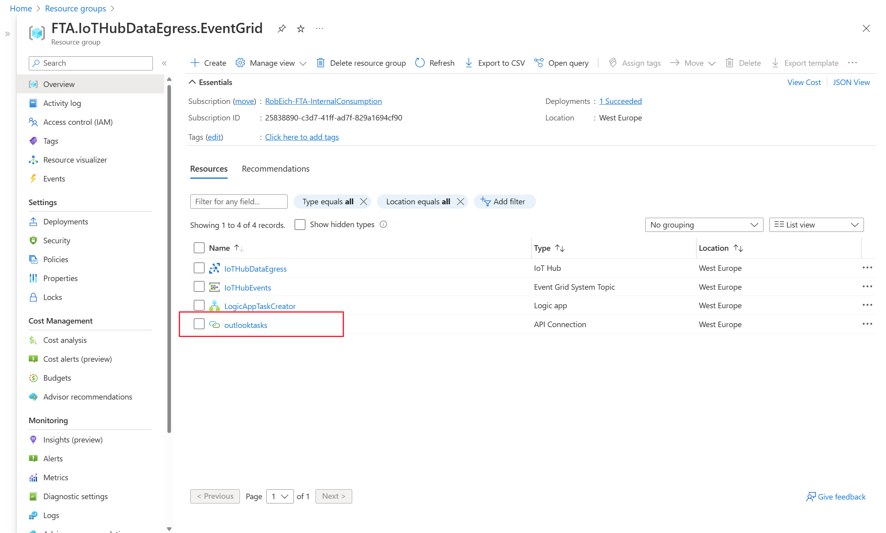
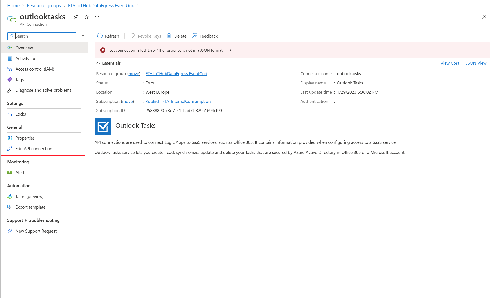
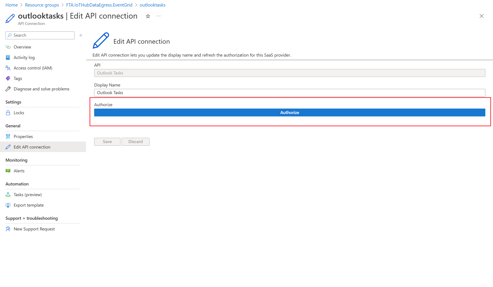
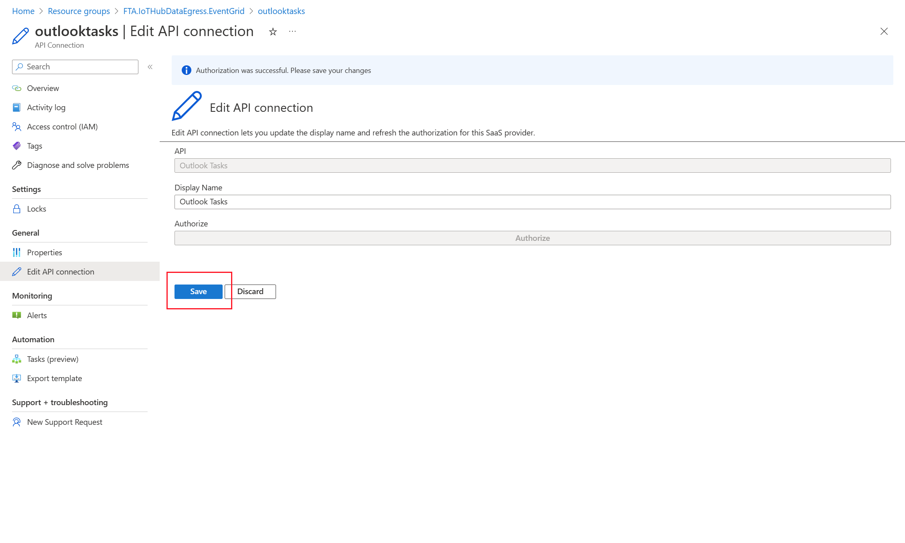

# Authenticate Outlook connector

Select ***outlooktasks*** in newly created Resource Group

Click on ***Edit API connection***

Click on ***Authorize*** and provide credentials where you have access to Outlook.com

Click ***Save***

