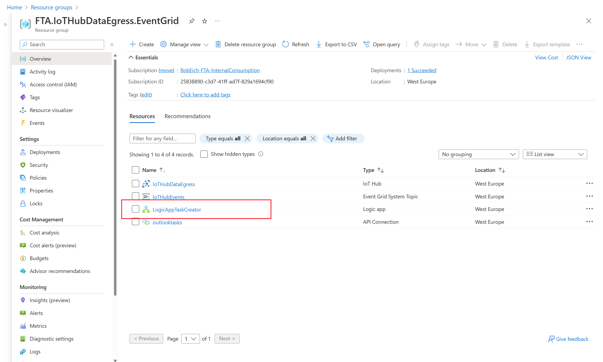
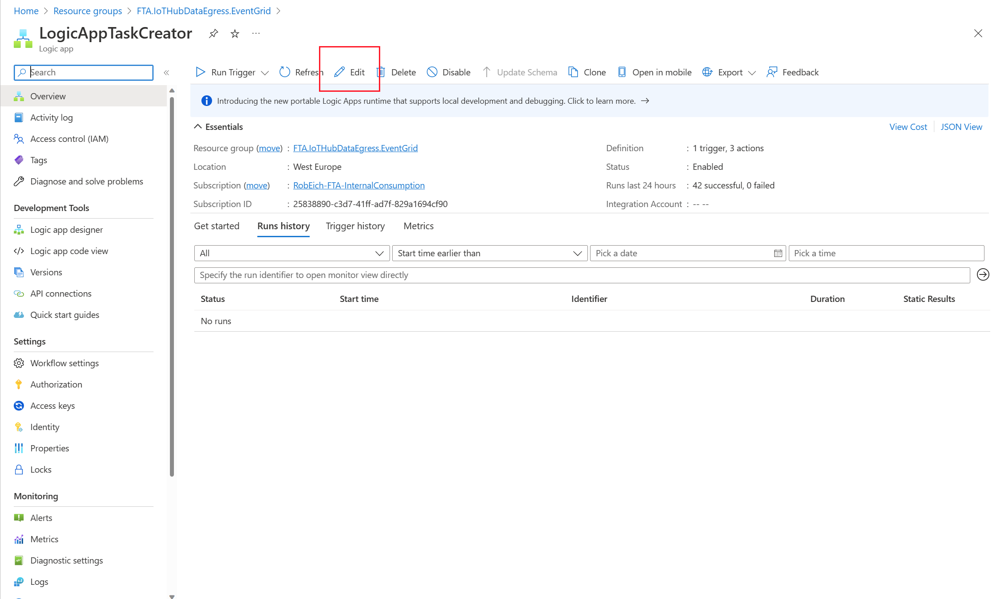
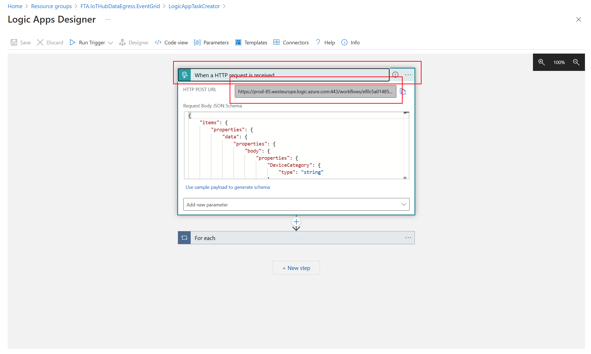
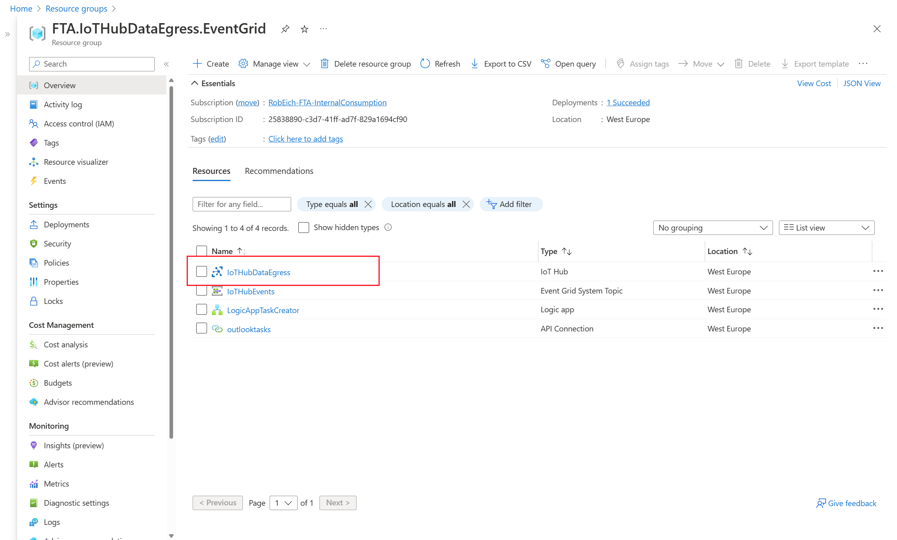
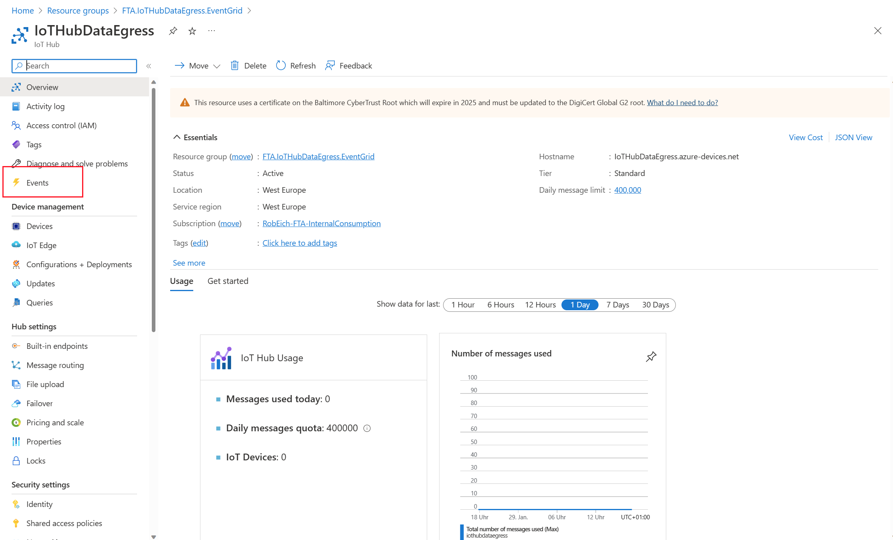
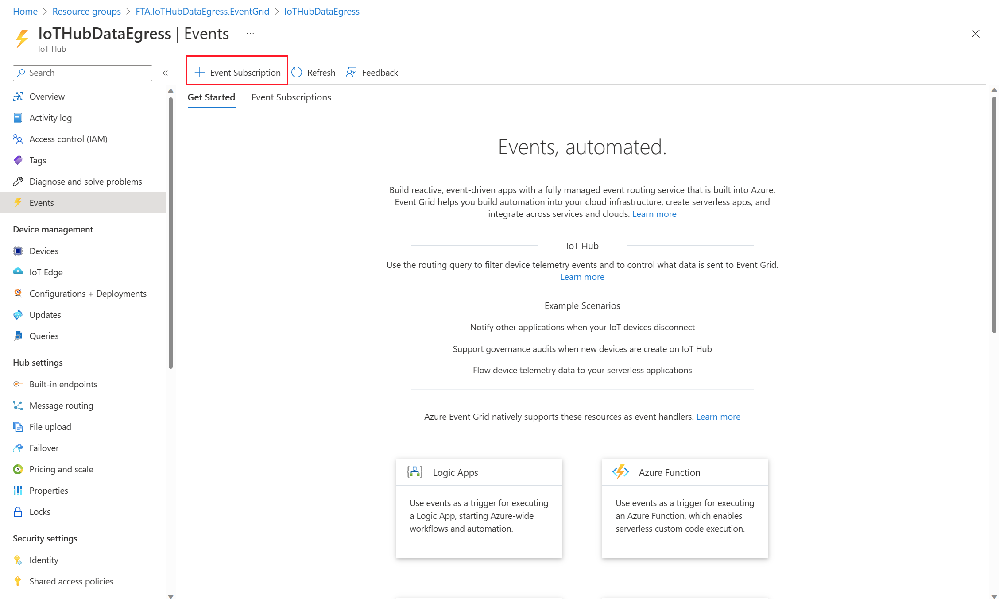
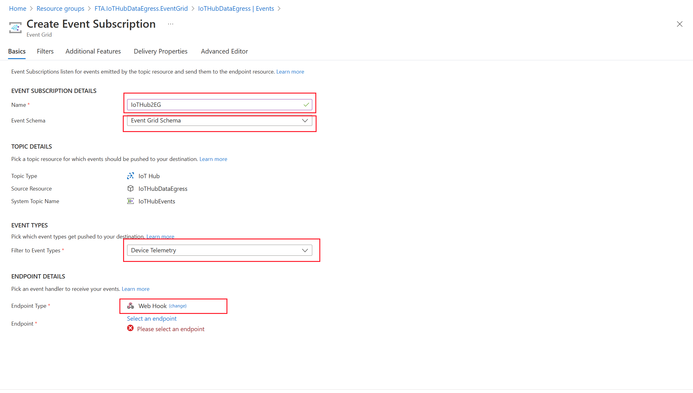
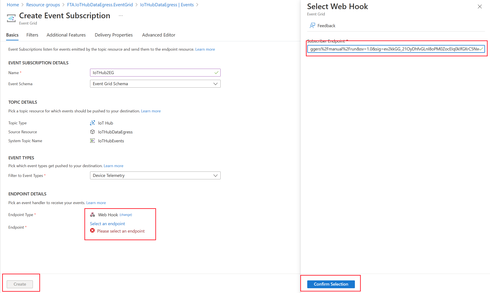

# Create IoT Hub Event Registration

## Retrieve Logic App Webhook Url

Go back to the Resource Group and select the Logic App "LogicAppTaskCreator"

Click on ***Edit***

Copy webhook Url

## Configure IoT Hub

Go back to the Resource Group and select the IoT Hub within the Resource Group

Click on ***Events***

Click on ***+ Event Subscription***

Provide the following configuration:

- Event Subscription Details Name: IoTHub2EG
- Check if "Event Grid Schema" in EventSchema is selected
- EventTypes: Just select Device Telemetry
  ***Attention***: Take care that nothing else is selected! 
  
- Select Webhook as endpoint
- Click ***Please select and endpoint*** and provide Logic App webhook Url:

- Confirm selection
- Click ***Create***

***Attention***: IoT Hub goes in "Transitioning" state while configuration is applied. It is not reachable for devices or management calls.
